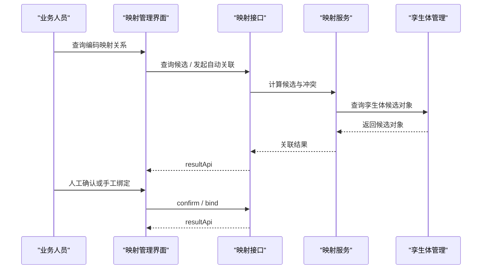

# 编码映射与自动关联功能接口设计

## 1. 设计目标

本功能用于建立编码标识与孪生体对象之间的桥接关系，支持候选建议、自动关联、人工确认、解绑定和冲突处理。

## 2. 核心概念

### 2.1 映射关系 Mapping Relation

映射关系表示某个编码对象与某个孪生体对象之间已经建立的绑定结果。

### 2.2 候选建议 Candidate Suggestion

候选建议是系统基于规则、属性相似度和已有上下文给出的待确认关联结果。

### 2.3 映射冲突 Mapping Conflict

映射冲突表示一个编码对应多个候选对象，或一个孪生体对象被多个编码竞争绑定。

## 3. 接口清单

| 接口 | 方法 | 用途 |
| --- | --- | --- |
| `/api/code-management/mappings/page` | `GET` | 分页查询映射关系 |
| `/api/code-management/mappings/{mappingId}` | `GET` | 查询映射详情 |
| `/api/code-management/mappings/candidates` | `POST` | 查询候选建议 |
| `/api/code-management/mappings/auto-associate` | `POST` | 发起自动关联 |
| `/api/code-management/mappings/bind` | `POST` | 手工绑定 |
| `/api/code-management/mappings/{mappingId}/confirm` | `POST` | 确认自动关联结果 |
| `/api/code-management/mappings/{mappingId}/unbind` | `POST` | 解除绑定 |

## 4. 关键接口设计

### 4.1 查询候选建议

```text
POST /api/code-management/mappings/candidates
```

请求体示例：

```json
{
  "codeId": "CODE-0001",
  "codeValue": "WTG-A01-001",
  "subjectType": "device"
}
```

响应体示例：

```json
{
  "code": 200,
  "msg": "操作成功",
  "data": {
    "candidates": [
      {
        "twinId": "TWIN-1001",
        "twinName": "A01风机001",
        "score": 0.96,
        "matchReasons": ["businessCode-match", "area-match"]
      }
    ]
  }
}
```

### 4.2 发起自动关联

```text
POST /api/code-management/mappings/auto-associate
```

请求体示例：

```json
{
  "codeIds": ["CODE-0001", "CODE-0002"],
  "strategy": "rule-first"
}
```

响应体示例：

```json
{
  "code": 200,
  "msg": "操作成功",
  "data": {
    "matchedCount": 1,
    "warningCount": 1,
    "results": [
      {
        "codeId": "CODE-0001",
        "mappingStatus": "pending-confirm",
        "candidateTwinId": "TWIN-1001"
      }
    ]
  }
}
```

### 4.3 手工绑定

```text
POST /api/code-management/mappings/bind
```

请求体示例：

```json
{
  "codeId": "CODE-0001",
  "twinId": "TWIN-1001",
  "bindMode": "manual"
}
```

响应体示例：

```json
{
  "code": 201,
  "msg": "对象创建成功",
  "data": {
    "mappingId": "MAP-0001",
    "mappingStatus": "confirmed"
  }
}
```

## 5. 关键对象

| 对象 | 字段 | 说明 |
| --- | --- | --- |
| `MappingRelation` | `mappingId` `codeId` `twinId` `mappingStatus` | 映射结果 |
| `CandidateSuggestion` | `twinId` `score` `matchReasons` | 候选建议 |
| `MappingConflict` | `conflictType` `conflictTargets` | 冲突对象 |

## 6. 字段级数据字典

### 6.1 MappingCandidateRequest

| 字段 | 类型 | 必填 | 说明 | 映射关系 |
| --- | --- | --- | --- | --- |
| `codeId` | string | 是 | 编码记录 ID | `z_code_record.code_id` |
| `codeValue` | string | 是 | 编码值 | `z_code_record.code_value` |
| `subjectType` | string | 是 | 对象类型 | `z_code_record.subject_type` |

### 6.2 CandidateSuggestion

| 字段 | 类型 | 必填 | 说明 | 映射关系 |
| --- | --- | --- | --- | --- |
| `twinId` | string | 是 | 候选孪生体 ID | 运行态引用孪生体主键 |
| `twinName` | string | 是 | 候选孪生体名称 | 运行态展示字段 |
| `score` | number | 是 | 匹配得分 | `z_code_mapping.match_score` |
| `matchReasons` | array<string> | 否 | 命中原因列表 | `z_code_mapping.match_reasons` |

### 6.3 AutoAssociateRequest

| 字段 | 类型 | 必填 | 说明 | 映射关系 |
| --- | --- | --- | --- | --- |
| `codeIds` | array<string> | 是 | 待关联编码 ID 列表 | `z_code_mapping.code_id` |
| `strategy` | string | 是 | 关联策略 | 运行态参数，不直接落表 |

### 6.4 MappingRelation

| 字段 | 类型 | 必填 | 说明 | 映射关系 |
| --- | --- | --- | --- | --- |
| `mappingId` | string | 是 | 映射关系 ID | `z_code_mapping.mapping_id` |
| `codeId` | string | 是 | 编码记录 ID | `z_code_mapping.code_id` |
| `twinId` | string | 否 | 孪生体 ID | `z_code_mapping.twin_id` |
| `mappingStatus` | string | 是 | 映射状态 | `z_code_mapping.mapping_status` |
| `candidateTwinId` | string | 否 | 当前候选对象 ID | `z_code_mapping.candidate_twin_id` |
| `createdBy` | string | 否 | 创建人 | `z_code_mapping.created_by` |
| `createdTime` | datetime/string | 否 | 创建时间 | `z_code_mapping.created_time` |
| `updatedBy` | string | 否 | 更新人 | `z_code_mapping.updated_by` |
| `updatedTime` | datetime/string | 否 | 更新时间 | `z_code_mapping.updated_time` |
| `deletedFlag` | integer | 否 | 删除标记 | `z_code_mapping.deleted_flag` |

### 6.5 ManualBindRequest

| 字段 | 类型 | 必填 | 说明 | 映射关系 |
| --- | --- | --- | --- | --- |
| `codeId` | string | 是 | 编码记录 ID | `z_code_mapping.code_id` |
| `twinId` | string | 是 | 绑定孪生体 ID | `z_code_mapping.twin_id` |
| `bindMode` | string | 是 | 绑定方式 | `z_code_mapping.bind_mode` |

### 6.6 MappingConflict

| 字段 | 类型 | 必填 | 说明 | 映射关系 |
| --- | --- | --- | --- | --- |
| `conflictType` | string | 是 | 冲突类型 | `z_code_mapping.conflict_type` |
| `conflictTargets` | array<string> | 是 | 冲突目标列表 | `z_code_mapping.conflict_targets` |

## 7. MySQL 数据库表示例

### 7.1 编码映射表 `z_code_mapping`

```sql
CREATE TABLE `z_code_mapping` (
  `mapping_id` varchar(64) NOT NULL COMMENT '映射关系主键',
  `code_id` varchar(64) NOT NULL COMMENT '编码记录主键',
  `twin_id` varchar(64) DEFAULT NULL COMMENT '孪生体主键引用',
  `mapping_status` varchar(32) NOT NULL COMMENT '映射状态',
  `candidate_twin_id` varchar(64) DEFAULT NULL COMMENT '候选孪生体主键',
  `match_score` decimal(5,2) DEFAULT NULL COMMENT '匹配得分',
  `match_reasons` json DEFAULT NULL COMMENT '命中原因列表',
  `bind_mode` varchar(32) DEFAULT NULL COMMENT '绑定方式',
  `conflict_type` varchar(64) DEFAULT NULL COMMENT '冲突类型',
  `conflict_targets` json DEFAULT NULL COMMENT '冲突目标列表',
  `created_by` varchar(64) DEFAULT NULL COMMENT '创建人',
  `created_time` datetime DEFAULT NULL COMMENT '创建时间',
  `updated_by` varchar(64) DEFAULT NULL COMMENT '更新人',
  `updated_time` datetime DEFAULT NULL COMMENT '更新时间',
  `deleted_flag` tinyint(1) NOT NULL DEFAULT 0 COMMENT '删除标记',
  PRIMARY KEY (`mapping_id`),
  KEY `idx_z_code_mapping_code_id` (`code_id`),
  KEY `idx_z_code_mapping_twin_id` (`twin_id`)
) ENGINE=InnoDB DEFAULT CHARSET=utf8mb4 COMMENT='编码映射关系表';
```

## 8. 常用状态码

| 状态码 | 使用场景 |
| --- | --- |
| `200` | 查询候选、自动关联成功 |
| `201` | 手工绑定成功 |
| `400` | 参数错误、绑定对象不完整 |
| `404` | 编码或孪生体对象不存在 |
| `409` | 绑定冲突、重复绑定 |
| `601` | 自动关联给出候选但需人工确认 |

## 9. 系统序列图



## 10. 设计结论

映射功能的重点不是一次性做到复杂算法，而是先把候选建议、自动关联和人工确认三段链路串起来，让桥接关系可维护、可解释、可复核。
