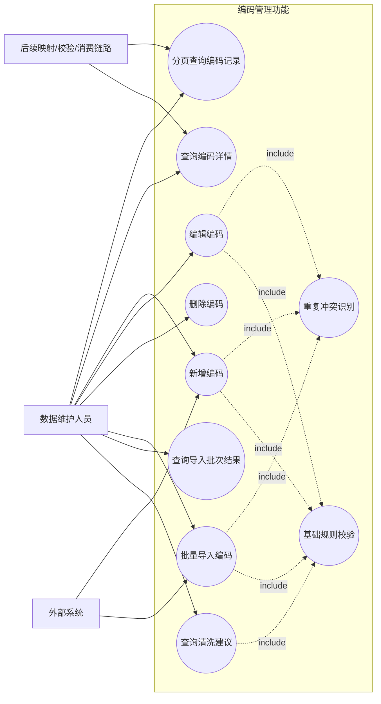
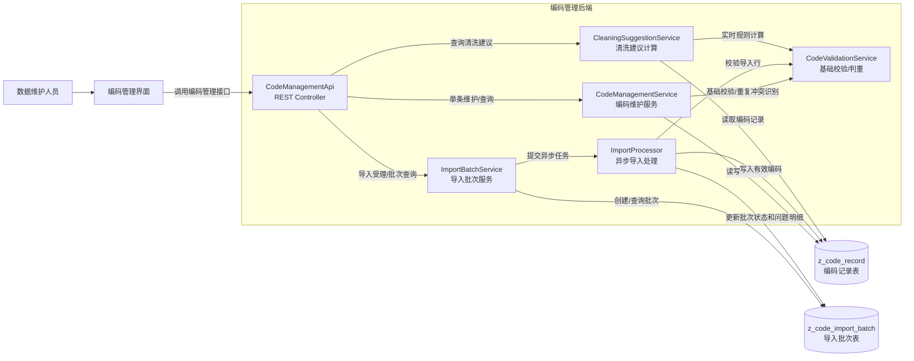
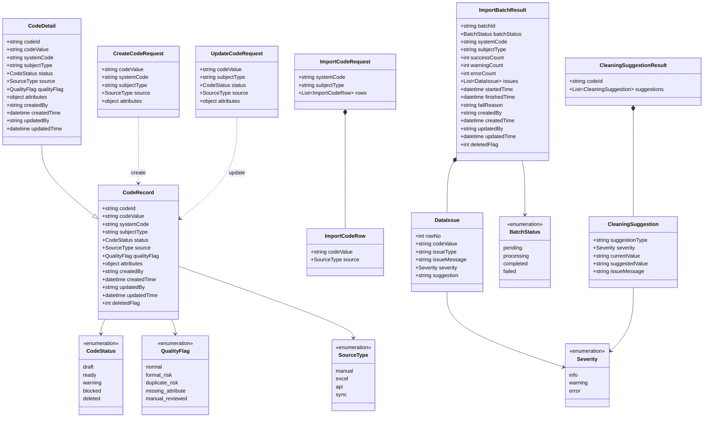
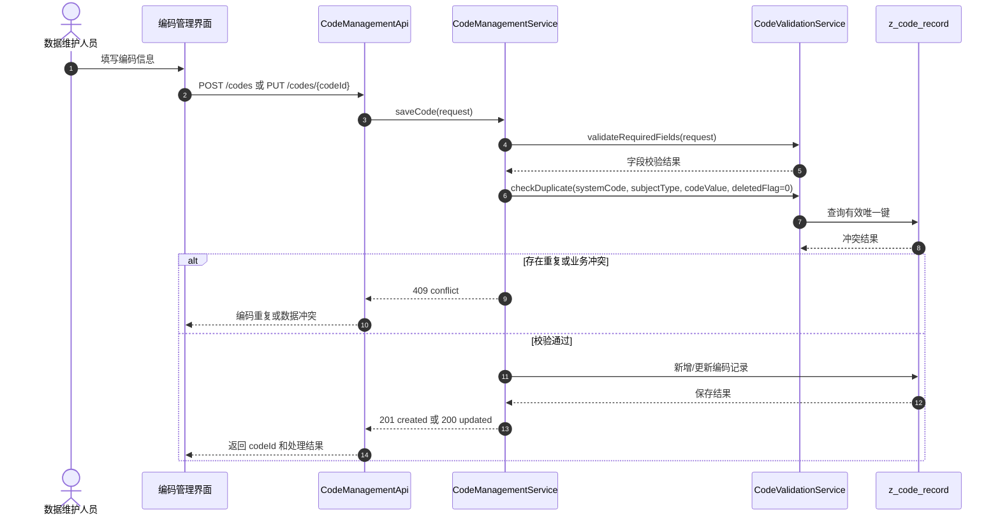
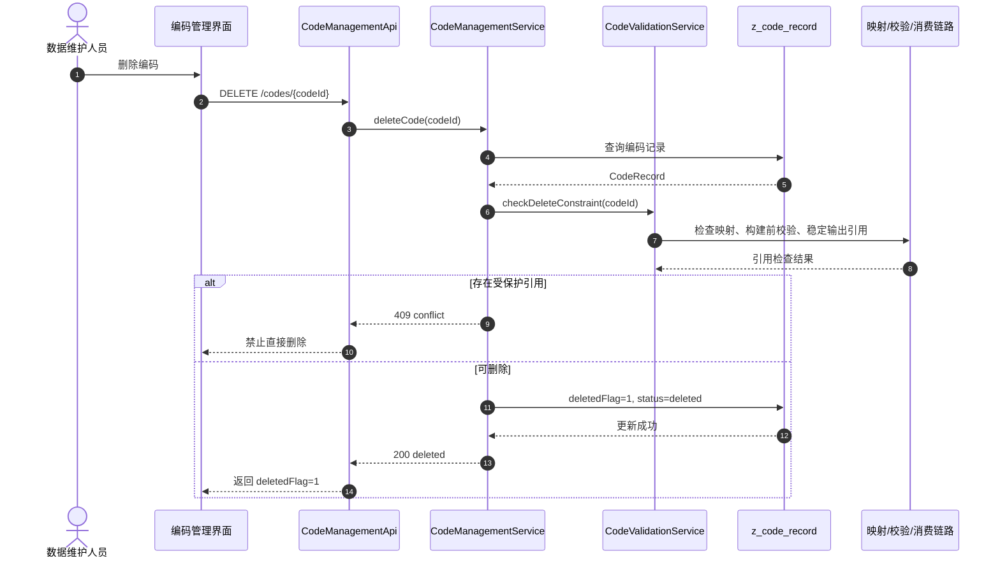
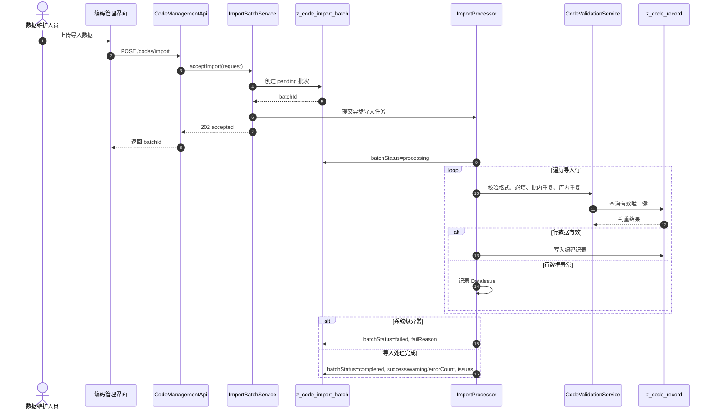
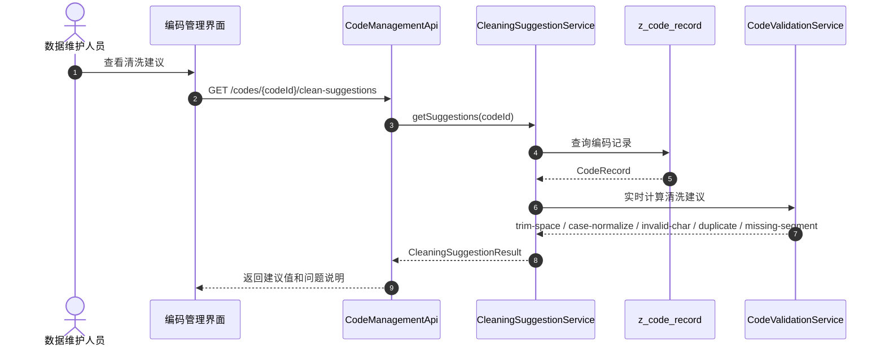
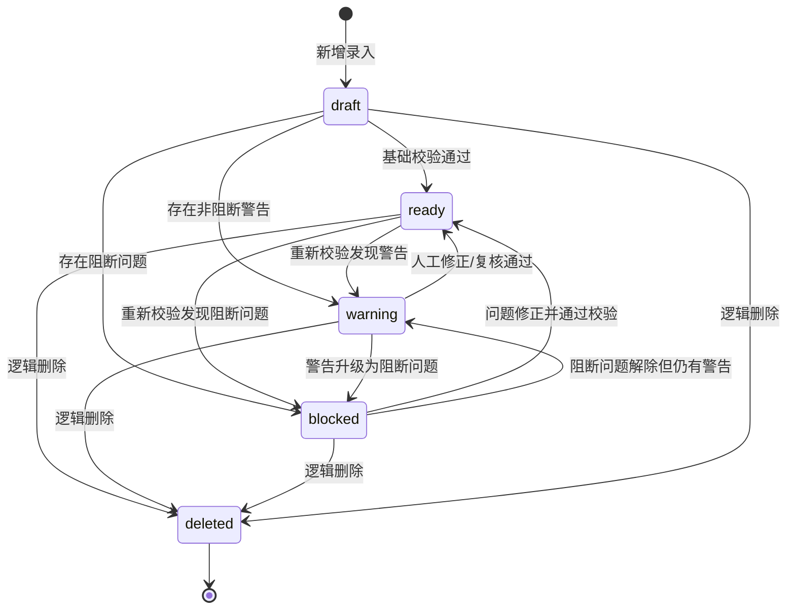
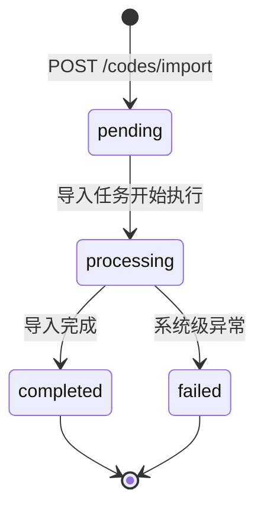
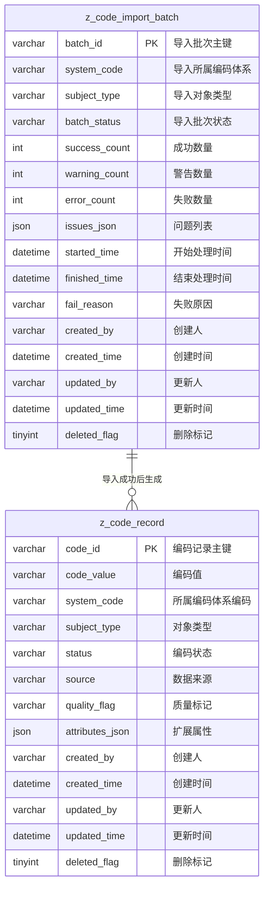

# 编码管理功能 UML

本文档基于《编码管理功能接口设计》转换，使用 Mermaid 表达 UML 视图，便于在 Obsidian 中直接预览和维护。

## 1. 用例图

## 2. 组件图

## 3. 类图

说明：`QualityFlag` 在 Mermaid 类图中使用下划线形式以增强 Obsidian 渲染兼容性；接口真实取值仍为 `format-risk`、`duplicate-risk`、`missing-attribute`、`manual-reviewed`。

## 4. 接口时序图

### 4.1 新增或编辑编码

### 4.2 删除编码

### 4.3 批量导入编码

### 4.4 查询清洗建议

## 5. 状态机图

### 5.1 编码记录状态机

### 5.2 导入批次状态机

## 6. ER 图

## 7. 接口与对象映射

| 接口 | UML 参与对象 | 主要结果 |
| --- | --- | --- |
| `GET /api/code-management/codes/page` | `CodeRecord` | 分页返回编码记录列表 |
| `GET /api/code-management/codes/{codeId}` | `CodeDetail` | 返回编码详情 |
| `POST /api/code-management/codes` | `CreateCodeRequest` `CodeRecord` | 创建编码并返回 `codeId` |
| `PUT /api/code-management/codes/{codeId}` | `UpdateCodeRequest` `CodeRecord` | 更新编码并重新校验状态 |
| `DELETE /api/code-management/codes/{codeId}` | `CodeRecord` | 逻辑删除，`deletedFlag=1` 且 `status=deleted` |
| `POST /api/code-management/codes/import` | `ImportCodeRequest` `ImportCodeRow` `ImportBatchResult` | 创建导入批次并异步处理 |
| `GET /api/code-management/import-batches/{batchId}` | `ImportBatchResult` `DataIssue` | 查询导入结果、统计数和问题明细 |
| `GET /api/code-management/codes/{codeId}/clean-suggestions` | `CleaningSuggestionResult` `CleaningSuggestion` | 实时返回清洗建议，不直接修改原始数据 |

## 8. 关键业务约束

- 有效唯一键：`systemCode + subjectType + codeValue + deletedFlag`。
- 新增、编辑、导入发现有效重复记录时返回 `409`。
- 同一导入批次内重复编码按 `duplicate-in-batch` 记入 `issues`，不落正式编码表。
- 删除采用逻辑删除；存在已确认映射、构建前校验引用或稳定消费输出引用时返回 `409`。
- 编辑接口不允许修改 `systemCode`。
- 清洗建议按实时规则计算，不单独落库，不自动覆盖原始编码。

## 9. Obsidian 渲染说明

- 图块均使用 `mermaid` 代码块，Obsidian 默认支持 Mermaid 渲染。
- 若需要增强导出或样式能力，可使用常见 Mermaid/Markdown 导出插件；不依赖 PlantUML、Java 或远程渲染服务。
