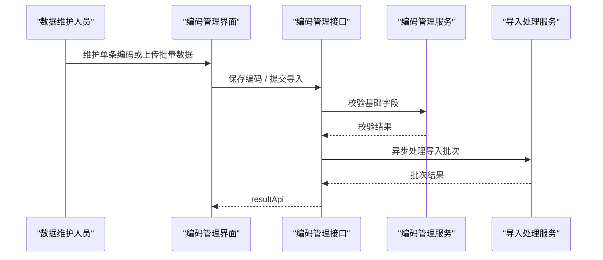

# 编码管理功能接口设计

## 1. 设计目标

本功能用于维护编码数据本身，支撑单条维护、批量导入、智能校验、清洗建议和重复冲突识别，为映射、校验和消费输出提供稳定编码底座。

## 2. 核心概念

### 2.1 编码记录 Code Record

编码记录是系统中最基础的数据对象，表示一个被纳管的编码实例。

### 2.2 导入批次 Import Batch

导入批次用于承载一次批量导入任务及其结果，包括成功数、失败数、警告数和问题明细。

### 2.3 清洗建议 Cleaning Suggestion

清洗建议是系统基于规则判断给出的数据修正提示，不直接自动覆盖原始数据。

## 3. 接口清单

| 接口                                                      | 方法       | 用途       |
| ------------------------------------------------------- | -------- | -------- |
| `/api/code-management/codes/page`                       | `GET`    | 分页查询编码记录 |
| `/api/code-management/codes/{codeId}`                   | `GET`    | 查询编码详情   |
| `/api/code-management/codes`                            | `POST`   | 新增编码     |
| `/api/code-management/codes/{codeId}`                   | `PUT`    | 编辑编码     |
| `/api/code-management/codes/{codeId}`                   | `DELETE` | 删除编码     |
| `/api/code-management/codes/import`                     | `POST`   | 批量导入编码   |
| `/api/code-management/import-batches/{batchId}`         | `GET`    | 查询导入批次结果 |
| `/api/code-management/codes/{codeId}/clean-suggestions` | `GET`    | 查询清洗建议   |

## 4. 关键接口设计

### 4.1 分页查询编码

```text
GET /api/code-management/codes/page?pageNum=1&pageSize=20&keyword=WTG&systemCode=KKS&subjectType=device&status=warning&source=manual
```

分页响应体示例：

```json
{
  "total": 100,
  "rows": [
    {
      "codeId": "CODE-0001",
      "codeValue": "WTG-A01-001",
      "systemCode": "KKS",
      "subjectType": "device",
      "status": "warning",
      "source": "manual",
      "qualityFlag": "duplicate-risk"
    }
  ],
  "code": 200,
  "msg": "查询成功"
}
```

### 4.2 查询编码详情

```text
GET /api/code-management/codes/{codeId}
```

响应体示例：

```json
{
  "code": 200,
  "msg": "操作成功",
  "data": {
    "codeId": "CODE-0001",
    "codeValue": "WTG-A01-001",
    "systemCode": "KKS",
    "subjectType": "device",
    "status": "ready",
    "source": "manual",
    "qualityFlag": "normal",
    "attributes": {
      "areaCode": "A01",
      "deviceNo": "001"
    },
    "createdBy": "admin",
    "createdTime": "2026-04-22 10:00:00",
    "updatedBy": "admin",
    "updatedTime": "2026-04-22 10:00:00"
  }
}
```

### 4.3 新增编码

```text
POST /api/code-management/codes
```

请求体示例：

```json
{
  "codeValue": "WTG-A01-001",
  "systemCode": "KKS",
  "subjectType": "device",
  "source": "manual",
  "attributes": {
    "areaCode": "A01",
    "deviceNo": "001"
  }
}
```

响应体示例：

```json
{
  "code": 201,
  "msg": "对象创建成功",
  "data": {
    "codeId": "CODE-0001"
  }
}
```

### 4.4 编辑编码

```text
PUT /api/code-management/codes/{codeId}
```

请求体示例：

```json
{
  "codeValue": "WTG-A01-001",
  "subjectType": "device",
  "status": "ready",
  "source": "manual",
  "attributes": {
    "areaCode": "A01",
    "deviceNo": "001",
    "assetName": "1号风机"
  }
}
```

响应体示例：

```json
{
  "code": 200,
  "msg": "操作成功",
  "data": {
    "codeId": "CODE-0001",
    "updated": true
  }
}
```

### 4.5 删除编码

```text
DELETE /api/code-management/codes/{codeId}
```

响应体示例：

```json
{
  "code": 200,
  "msg": "操作成功",
  "data": {
    "codeId": "CODE-0001",
    "deletedFlag": 1
  }
}
```

### 4.6 批量导入编码

```text
POST /api/code-management/codes/import
```

请求体示例：

```json
{
  "systemCode": "KKS",
  "subjectType": "device",
  "rows": [
    {
      "codeValue": "WTG-A01-001",
      "source": "excel"
    },
    {
      "codeValue": "WTG-A01-002",
      "source": "excel"
    }
  ]
}
```

响应体示例：

```json
{
  "code": 202,
  "msg": "请求已接受",
  "data": {
    "batchId": "IMPORT-20260422-001"
  }
}
```

### 4.7 查询导入批次结果

```text
GET /api/code-management/import-batches/{batchId}
```

响应体示例：

```json
{
  "code": 200,
  "msg": "操作成功",
  "data": {
    "batchId": "IMPORT-20260422-001",
    "batchStatus": "completed",
    "successCount": 98,
    "warningCount": 1,
    "errorCount": 1,
    "issues": [
      {
        "rowNo": 13,
        "codeValue": "WTG-A01-00X",
        "issueType": "format-error",
        "suggestion": "设备号应为3位数字"
      }
    ]
  }
}
```

### 4.8 查询清洗建议

```text
GET /api/code-management/codes/{codeId}/clean-suggestions
```

响应体示例：

```json
{
  "code": 200,
  "msg": "操作成功",
  "data": {
    "codeId": "CODE-0001",
    "suggestions": [
      {
        "suggestionType": "trim-space",
        "severity": "warning",
        "currentValue": " WTG-A01-001 ",
        "suggestedValue": "WTG-A01-001",
        "issueMessage": "编码前后存在无效空格"
      }
    ]
  }
}
```

## 5. 关键对象

| 对象 | 字段 | 说明 |
| --- | --- | --- |
| `CodeRecord` | `codeId` `codeValue` `systemCode` `subjectType` `status` | 编码记录 |
| `ImportBatch` | `batchId` `batchStatus` `successCount` `warningCount` `errorCount` | 导入批次 |
| `DataIssue` | `issueType` `issueMessage` `suggestion` | 数据问题和建议 |
| `CleaningSuggestion` | `suggestionType` `severity` `currentValue` `suggestedValue` | 清洗建议 |

## 6. 字段级数据字典

### 6.1 CodeRecord

| 字段            | 类型              | 必填  | 说明      | 映射关系                         |
| ------------- | --------------- | --- | ------- | ---------------------------- |
| `codeId`      | string          | 是   | 编码记录 ID | `z_code_record.code_id`      |
| `codeValue`   | string          | 是   | 编码值     | `z_code_record.code_value`   |
| `systemCode`  | string          | 是   | 所属编码体系  | `z_code_record.system_code`  |
| `subjectType` | string          | 是   | 对象类型    | `z_code_record.subject_type` |
| `status`      | string          | 是   | 数据状态    | `z_code_record.status`       |
| `source`      | string          | 否   | 数据来源    | `z_code_record.source`       |
| `qualityFlag` | string          | 否   | 质量标记    | `z_code_record.quality_flag` |
| `createdBy`   | string          | 否   | 创建人     | `z_code_record.created_by`   |
| `createdTime` | datetime/string | 否   | 创建时间    | `z_code_record.created_time` |
| `updatedBy`   | string          | 否   | 更新人     | `z_code_record.updated_by`   |
| `updatedTime` | datetime/string | 否   | 更新时间    | `z_code_record.updated_time` |
| `deletedFlag` | integer         | 否   | 删除标记    | `z_code_record.deleted_flag` |

### 6.2 CreateCodeRequest

| 字段 | 类型 | 必填 | 说明 | 映射关系 |
| --- | --- | --- | --- | --- |
| `codeValue` | string | 是 | 编码值 | `z_code_record.code_value` |
| `systemCode` | string | 是 | 编码体系编码 | `z_code_record.system_code` |
| `subjectType` | string | 是 | 对象类型 | `z_code_record.subject_type` |
| `source` | string | 是 | 来源类型 | `z_code_record.source` |
| `attributes` | object | 否 | 扩展属性 | `z_code_record.attributes_json` |

### 6.3 CodeDetail

| 字段 | 类型 | 必填 | 说明 | 映射关系 |
| --- | --- | --- | --- | --- |
| `codeId` | string | 是 | 编码记录 ID | `z_code_record.code_id` |
| `codeValue` | string | 是 | 编码值 | `z_code_record.code_value` |
| `systemCode` | string | 是 | 编码体系编码 | `z_code_record.system_code` |
| `subjectType` | string | 是 | 对象类型 | `z_code_record.subject_type` |
| `status` | string | 是 | 数据状态 | `z_code_record.status` |
| `source` | string | 是 | 来源类型 | `z_code_record.source` |
| `qualityFlag` | string | 否 | 质量标记 | `z_code_record.quality_flag` |
| `attributes` | object | 否 | 扩展属性 | `z_code_record.attributes_json` |
| `createdBy` | string | 否 | 创建人 | `z_code_record.created_by` |
| `createdTime` | datetime/string | 否 | 创建时间 | `z_code_record.created_time` |
| `updatedBy` | string | 否 | 更新人 | `z_code_record.updated_by` |
| `updatedTime` | datetime/string | 否 | 更新时间 | `z_code_record.updated_time` |

### 6.4 UpdateCodeRequest

| 字段 | 类型 | 必填 | 说明 | 映射关系 |
| --- | --- | --- | --- | --- |
| `codeValue` | string | 是 | 编码值 | `z_code_record.code_value` |
| `subjectType` | string | 是 | 对象类型 | `z_code_record.subject_type` |
| `status` | string | 是 | 数据状态 | `z_code_record.status` |
| `source` | string | 是 | 来源类型 | `z_code_record.source` |
| `attributes` | object | 否 | 扩展属性 | `z_code_record.attributes_json` |

### 6.5 ImportCodeRow

| 字段 | 类型 | 必填 | 说明 | 映射关系 |
| --- | --- | --- | --- | --- |
| `codeValue` | string | 是 | 导入编码值 | `z_code_record.code_value` |
| `source` | string | 是 | 导入来源 | `z_code_record.source` |

### 6.6 ImportBatchResult

| 字段 | 类型 | 必填 | 说明 | 映射关系 |
| --- | --- | --- | --- | --- |
| `batchId` | string | 是 | 导入批次 ID | `z_code_import_batch.batch_id` |
| `batchStatus` | string | 是 | 导入批次状态 | `z_code_import_batch.batch_status` |
| `systemCode` | string | 否 | 导入所属编码体系 | `z_code_import_batch.system_code` |
| `subjectType` | string | 否 | 导入对象类型 | `z_code_import_batch.subject_type` |
| `successCount` | integer | 是 | 成功数量 | `z_code_import_batch.success_count` |
| `warningCount` | integer | 是 | 警告数量 | `z_code_import_batch.warning_count` |
| `errorCount` | integer | 是 | 失败数量 | `z_code_import_batch.error_count` |
| `issues` | array<object> | 否 | 问题列表 | `z_code_import_batch.issues_json` |
| `startedTime` | datetime/string | 否 | 开始处理时间 | `z_code_import_batch.started_time` |
| `finishedTime` | datetime/string | 否 | 结束处理时间 | `z_code_import_batch.finished_time` |
| `failReason` | string | 否 | 批次失败原因 | `z_code_import_batch.fail_reason` |
| `createdBy` | string | 否 | 创建人 | `z_code_import_batch.created_by` |
| `createdTime` | datetime/string | 否 | 创建时间 | `z_code_import_batch.created_time` |
| `updatedBy` | string | 否 | 更新人 | `z_code_import_batch.updated_by` |
| `updatedTime` | datetime/string | 否 | 更新时间 | `z_code_import_batch.updated_time` |
| `deletedFlag` | integer | 否 | 删除标记 | `z_code_import_batch.deleted_flag` |

### 6.7 DataIssue

| 字段 | 类型 | 必填 | 说明 | 映射关系 |
| --- | --- | --- | --- | --- |
| `rowNo` | integer | 否 | 导入行号 | `z_code_import_batch.issues_json.rowNo` |
| `codeValue` | string | 否 | 问题编码值 | `z_code_import_batch.issues_json.codeValue` |
| `issueType` | string | 是 | 问题类型 | `z_code_import_batch.issues_json.issueType` |
| `issueMessage` | string | 是 | 问题说明 | `z_code_import_batch.issues_json.issueMessage` |
| `severity` | string | 是 | 问题级别 | `z_code_import_batch.issues_json.severity` |
| `suggestion` | string | 否 | 清洗建议 | `z_code_import_batch.issues_json.suggestion` |

### 6.8 CleaningSuggestion

| 字段 | 类型 | 必填 | 说明 | 映射关系 |
| --- | --- | --- | --- | --- |
| `suggestionType` | string | 是 | 建议类型 | 运行态结果，不直接落表 |
| `severity` | string | 是 | 建议级别 | 运行态结果，不直接落表 |
| `currentValue` | string | 是 | 当前值 | `z_code_record.code_value` |
| `suggestedValue` | string | 否 | 建议值 | 运行态结果，不直接落表 |
| `issueMessage` | string | 是 | 建议说明 | 运行态结果，不直接落表 |

### 6.9 枚举字典

#### 6.9.1 `status`

| 取值 | 说明 |
| --- | --- |
| `draft` | 草稿态，已录入但未完成规则校验 |
| `ready` | 数据完整，可进入后续映射与校验链路 |
| `warning` | 可继续推进，但存在警告项 |
| `blocked` | 存在阻断问题，不能进入后续链路 |
| `deleted` | 已逻辑删除 |

#### 6.9.2 `qualityFlag`

| 取值 | 说明 |
| --- | --- |
| `normal` | 质量正常 |
| `format-risk` | 格式存在风险 |
| `duplicate-risk` | 存在重复风险 |
| `missing-attribute` | 扩展属性缺失 |
| `manual-reviewed` | 已人工复核 |

#### 6.9.3 `source`

| 取值 | 说明 |
| --- | --- |
| `manual` | 后台手工录入 |
| `excel` | Excel 导入 |
| `api` | 外部接口写入 |
| `sync` | 第三方同步写入 |

#### 6.9.4 `batchStatus`

| 取值 | 说明 |
| --- | --- |
| `pending` | 已受理，待处理 |
| `processing` | 正在导入 |
| `completed` | 导入完成 |
| `failed` | 导入失败 |

#### 6.9.5 `severity`

| 取值 | 说明 |
| --- | --- |
| `info` | 信息提示 |
| `warning` | 警告，不阻断 |
| `error` | 错误，阻断处理 |

## 7. 实现约束与业务规则

### 7.1 判重规则

- 编码记录的有效唯一键使用 `systemCode + subjectType + codeValue + deletedFlag`。
- 当存在 `deletedFlag = 0` 的同组合记录时，新增、编辑、导入都必须返回 `409`。
- 同一导入批次内出现重复编码时，后出现记录按 `duplicate-in-batch` 记入 `issues`，不落正式编码表。
- 逻辑删除记录不参与有效唯一性判断，允许后续重新创建新的有效记录。

### 7.2 删除规则

- 删除接口采用逻辑删除，不做物理删除。
- 删除成功后应将 `deletedFlag` 置为 `1`，并将 `status` 更新为 `deleted`。
- 当编码已存在已确认映射、正在被构建前校验引用，或已形成稳定消费输出时，应返回 `409`，禁止直接删除。

### 7.3 导入批次状态机

- 调用导入接口后，批次初始状态为 `pending`。
- 导入任务开始执行后更新为 `processing`。
- 导入完成后统一收口为 `completed`；是否存在警告由 `warningCount` 和 `issues` 判断。
- 导入过程中出现系统级异常时更新为 `failed`，并写入 `failReason`。

### 7.4 清洗建议规则

- 清洗建议接口默认按实时规则计算，不单独落库。
- 清洗建议至少覆盖：首尾空格、大小写统一、非法字符替换、编码重复提示、缺失分段提示。
- 清洗建议只返回建议值和问题说明，不直接修改原始编码数据。

### 7.5 编辑规则

- 编辑接口不允许修改 `systemCode`，避免跨编码体系漂移；如需迁移体系，应新建编码后再停用旧编码。
- 编辑后应重新触发基础校验，更新 `status` 与 `qualityFlag`。

## 8. MySQL 数据库表示例

### 8.1 编码记录表 `z_code_record`

```sql
CREATE TABLE `z_code_record` (
  `code_id` varchar(64) NOT NULL COMMENT '编码记录主键',
  `code_value` varchar(128) NOT NULL COMMENT '编码值',
  `system_code` varchar(64) NOT NULL COMMENT '所属编码体系编码',
  `subject_type` varchar(64) NOT NULL COMMENT '对象类型',
  `status` varchar(32) NOT NULL COMMENT '编码状态',
  `source` varchar(64) DEFAULT NULL COMMENT '数据来源',
  `quality_flag` varchar(64) DEFAULT NULL COMMENT '质量标记',
  `attributes_json` json DEFAULT NULL COMMENT '扩展属性',
  `created_by` varchar(64) DEFAULT NULL COMMENT '创建人',
  `created_time` datetime DEFAULT NULL COMMENT '创建时间',
  `updated_by` varchar(64) DEFAULT NULL COMMENT '更新人',
  `updated_time` datetime DEFAULT NULL COMMENT '更新时间',
  `deleted_flag` tinyint(1) NOT NULL DEFAULT 0 COMMENT '删除标记',
  PRIMARY KEY (`code_id`),
  UNIQUE KEY `uk_z_code_record_active` (`system_code`, `subject_type`, `code_value`, `deleted_flag`),
  KEY `idx_z_code_record_system_code` (`system_code`),
  KEY `idx_z_code_record_code_value` (`code_value`)
) ENGINE=InnoDB DEFAULT CHARSET=utf8mb4 COMMENT='编码记录表';
```

### 8.2 导入批次表 `z_code_import_batch`

```sql
CREATE TABLE `z_code_import_batch` (
  `batch_id` varchar(64) NOT NULL COMMENT '导入批次主键',
  `system_code` varchar(64) DEFAULT NULL COMMENT '导入所属编码体系',
  `subject_type` varchar(64) DEFAULT NULL COMMENT '导入对象类型',
  `batch_status` varchar(32) NOT NULL DEFAULT 'pending' COMMENT '导入批次状态',
  `success_count` int NOT NULL DEFAULT 0 COMMENT '成功数量',
  `warning_count` int NOT NULL DEFAULT 0 COMMENT '警告数量',
  `error_count` int NOT NULL DEFAULT 0 COMMENT '失败数量',
  `issues_json` json DEFAULT NULL COMMENT '问题列表',
  `started_time` datetime DEFAULT NULL COMMENT '开始处理时间',
  `finished_time` datetime DEFAULT NULL COMMENT '结束处理时间',
  `fail_reason` varchar(255) DEFAULT NULL COMMENT '失败原因',
  `created_by` varchar(64) DEFAULT NULL COMMENT '创建人',
  `created_time` datetime DEFAULT NULL COMMENT '创建时间',
  `updated_by` varchar(64) DEFAULT NULL COMMENT '更新人',
  `updated_time` datetime DEFAULT NULL COMMENT '更新时间',
  `deleted_flag` tinyint(1) NOT NULL DEFAULT 0 COMMENT '删除标记',
  PRIMARY KEY (`batch_id`)
) ENGINE=InnoDB DEFAULT CHARSET=utf8mb4 COMMENT='编码导入批次表';
```

## 9. 常用状态码

| 状态码 | 使用场景 |
| --- | --- |
| `200` | 查询、编辑、删除成功 |
| `201` | 新增编码成功 |
| `202` | 导入任务已受理 |
| `400` | 参数错误、导入格式错误 |
| `404` | 编码记录或导入批次不存在 |
| `409` | 编码重复或数据冲突 |
| `601` | 导入成功但存在警告或清洗建议 |

## 10. 系统序列图



## 11. 设计结论

编码管理接口要先把数据维护、导入回执和问题可见性建立起来，避免后续映射和校验建立在不可控的脏数据上。
