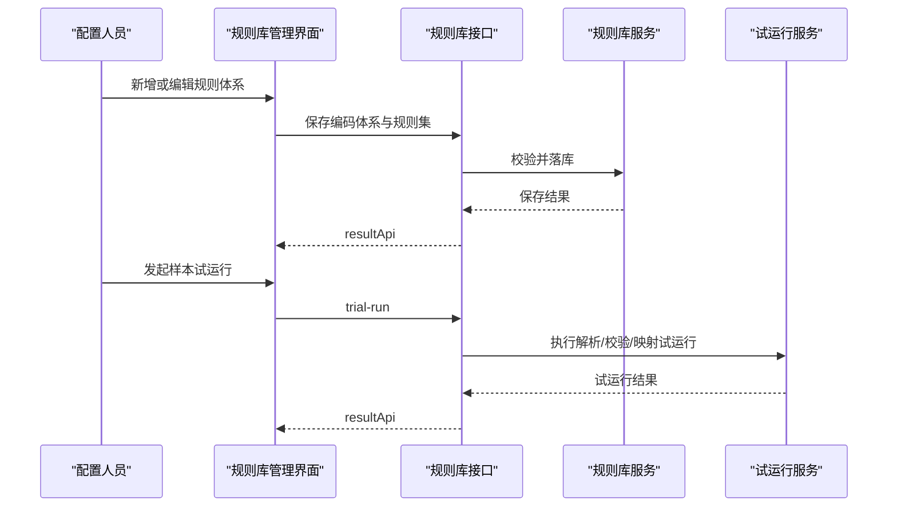

# 编码规则库管理功能接口设计

## 1. 设计目标

本功能用于支撑配置人员通过 GUI 维护 `KKS` 等编码体系、解析逻辑、校验正则和语义映射规则，为后续编码翻译、验码、映射和试运行提供统一规则来源。

## 2. 核心概念

### 2.1 编码体系 Code System

编码体系是规则管理的顶层对象，用于标识某一套工业编码标准及其适用对象范围。

### 2.2 规则集 Rule Set

规则集是某一编码体系下的一组可执行配置，至少包含解析规则、校验规则和语义映射规则。

### 2.3 试运行 Trial Run

试运行是对规则配置进行样本验证的过程，用于检查解析结果、校验结果和语义映射结果是否符合预期。

## 3. 接口清单

| 接口 | 方法 | 用途 |
| --- | --- | --- |
| `/api/code-management/rule-systems/page` | `GET` | 分页查询编码体系和规则集 |
| `/api/code-management/rule-systems/{systemId}` | `GET` | 查询编码体系详情 |
| `/api/code-management/rule-systems` | `POST` | 新增编码体系 |
| `/api/code-management/rule-systems/{systemId}` | `PUT` | 编辑编码体系 |
| `/api/code-management/rule-systems/{systemId}/status` | `PUT` | 启停编码体系 |
| `/api/code-management/rule-systems/{systemId}` | `DELETE` | 删除编码体系 |
| `/api/code-management/rule-sets/{ruleSetId}/trial-run` | `POST` | 样本试运行 |

## 4. 关键接口设计

### 4.1 分页查询编码体系

```text
GET /api/code-management/rule-systems/page?pageNum=1&pageSize=10&keyword=KKS&status=enabled
```

分页响应体示例：

```json
{
  "total": 2,
  "rows": [
    {
      "systemId": "SYS-KKS",
      "systemCode": "KKS",
      "systemName": "KKS编码体系",
      "subjectTypes": ["device", "point"],
      "status": "enabled",
      "ruleSetCount": 3,
      "updatedAt": "2026-04-22 10:00:00"
    }
  ],
  "code": 200,
  "msg": "查询成功"
}
```

### 4.2 新增编码体系

```text
POST /api/code-management/rule-systems
```

请求体示例：

```json
{
  "systemCode": "KKS",
  "systemName": "KKS编码体系",
  "subjectTypes": ["device", "point"],
  "parseRules": [
    {
      "ruleName": "设备编码解析",
      "expression": "([A-Z]{3})-([A-Z0-9]{2})-([0-9]{3})"
    }
  ],
  "verifyRules": [
    {
      "ruleName": "编码格式校验",
      "regex": "^[A-Z]{3}-[A-Z0-9]{2}-[0-9]{3}$"
    }
  ],
  "semanticMappings": [
    {
      "sourceSegment": "segment1",
      "targetField": "objectType"
    }
  ]
}
```

通用响应体示例：

```json
{
  "code": 201,
  "msg": "对象创建成功",
  "data": {
    "systemId": "SYS-KKS"
  }
}
```

### 4.3 启停编码体系

```text
PUT /api/code-management/rule-systems/{systemId}/status
```

请求体示例：

```json
{
  "status": "disabled"
}
```

响应体示例：

```json
{
  "code": 200,
  "msg": "操作成功",
  "data": {
    "systemId": "SYS-KKS",
    "status": "disabled"
  }
}
```

### 4.4 样本试运行

```text
POST /api/code-management/rule-sets/{ruleSetId}/trial-run
```

请求体示例：

```json
{
  "sampleCode": "WTG-A01-001",
  "subjectType": "device"
}
```

响应体示例：

```json
{
  "code": 200,
  "msg": "操作成功",
  "data": {
    "parseResult": {
      "segment1": "WTG",
      "segment2": "A01",
      "segment3": "001"
    },
    "verifyResult": {
      "passed": true,
      "warnings": []
    },
    "semanticResult": {
      "objectType": "device",
      "businessCode": "WTG-A01-001"
    }
  }
}
```

## 5. 关键对象

| 对象 | 字段 | 说明 |
| --- | --- | --- |
| `CodeSystem` | `systemId` `systemCode` `systemName` `status` | 编码体系基础信息 |
| `RuleSet` | `ruleSetId` `systemId` `subjectTypes` | 规则集定义 |
| `ParseRule` | `ruleName` `expression` | 解析逻辑 |
| `VerifyRule` | `ruleName` `regex` | 校验规则 |
| `SemanticMappingRule` | `sourceSegment` `targetField` | 语义映射配置 |

## 6. 字段级数据字典

### 6.1 RuleSystemPageRow

| 字段             | 类型              | 必填  | 说明      | 映射关系                          |
| -------------- | --------------- | --- | ------- | ----------------------------- |
| `systemId`     | string          | 是   | 编码体系 ID | `z_code_system.system_id`     |
| `systemCode`   | string          | 是   | 编码体系编码  | `z_code_system.system_code`   |
| `systemName`   | string          | 是   | 编码体系名称  | `z_code_system.system_name`   |
| `subjectTypes` | array<string>   | 否   | 适用对象列表  | `z_code_system.subject_types` |
| `status`       | string          | 是   | 启停状态    | `z_code_system.status`        |
| `ruleSetCount` | integer         | 是   | 规则集数量   | 运行态统计字段                       |
| `updatedAt`    | string          | 否   | 最近更新时间  | `z_code_system.updated_time`  |
| `createdBy`    | string          | 否   | 创建人     | `z_code_system.created_by`    |
| `createdTime`  | datetime/string | 否   | 创建时间    | `z_code_system.created_time`  |
| `updatedBy`    | string          | 否   | 更新人     | `z_code_system.updated_by`    |
| `deletedFlag`  | integer         | 否   | 删除标记    | `z_code_system.deleted_flag`  |

### 6.2 CreateCodeSystemRequest

| 字段 | 类型 | 必填 | 说明 | 映射关系 |
| --- | --- | --- | --- | --- |
| `systemCode` | string | 是 | 编码体系编码 | `z_code_system.system_code` |
| `systemName` | string | 是 | 编码体系名称 | `z_code_system.system_name` |
| `subjectTypes` | array<string> | 是 | 适用对象类型 | `z_code_system.subject_types` |
| `parseRules` | array<object> | 否 | 解析规则列表 | `z_code_rule_set.parse_rules_json` |
| `verifyRules` | array<object> | 否 | 校验规则列表 | `z_code_rule_set.verify_rules_json` |
| `semanticMappings` | array<object> | 否 | 语义映射规则列表 | `z_code_rule_set.semantic_mappings_json` |

### 6.3 ParseRule

| 字段 | 类型 | 必填 | 说明 | 映射关系 |
| --- | --- | --- | --- | --- |
| `ruleName` | string | 是 | 规则名称 | `z_code_rule_set.parse_rules_json.ruleName` |
| `expression` | string | 是 | 解析表达式 | `z_code_rule_set.parse_rules_json.expression` |

### 6.4 VerifyRule

| 字段 | 类型 | 必填 | 说明 | 映射关系 |
| --- | --- | --- | --- | --- |
| `ruleName` | string | 是 | 校验规则名称 | `z_code_rule_set.verify_rules_json.ruleName` |
| `regex` | string | 是 | 校验正则 | `z_code_rule_set.verify_rules_json.regex` |

### 6.5 SemanticMappingRule

| 字段 | 类型 | 必填 | 说明 | 映射关系 |
| --- | --- | --- | --- | --- |
| `sourceSegment` | string | 是 | 来源分段名 | `z_code_rule_set.semantic_mappings_json.sourceSegment` |
| `targetField` | string | 是 | 目标语义字段 | `z_code_rule_set.semantic_mappings_json.targetField` |

### 6.6 TrialRunRequest

| 字段 | 类型 | 必填 | 说明 | 映射关系 |
| --- | --- | --- | --- | --- |
| `sampleCode` | string | 是 | 样本编码值 | 运行态输入，不直接落表 |
| `subjectType` | string | 是 | 样本对象类型 | 运行态输入，不直接落表 |

### 6.7 TrialRunResponseData

| 字段 | 类型 | 必填 | 说明 | 映射关系 |
| --- | --- | --- | --- | --- |
| `parseResult` | object | 否 | 解析结果 | 运行态结果，不直接落表 |
| `verifyResult` | object | 否 | 校验结果 | 运行态结果，不直接落表 |
| `semanticResult` | object | 否 | 语义映射结果 | 运行态结果，不直接落表 |

## 7. MySQL 数据库表示例

### 7.1 编码体系表 `z_code_system`

```sql
CREATE TABLE `z_code_system` (
  `system_id` varchar(64) NOT NULL COMMENT '编码体系主键',
  `system_code` varchar(64) NOT NULL COMMENT '编码体系编码',
  `system_name` varchar(128) NOT NULL COMMENT '编码体系名称',
  `status` varchar(32) NOT NULL COMMENT '启停状态',
  `subject_types` json DEFAULT NULL COMMENT '适用对象类型列表',
  `created_by` varchar(64) DEFAULT NULL COMMENT '创建人',
  `created_time` datetime DEFAULT NULL COMMENT '创建时间',
  `updated_by` varchar(64) DEFAULT NULL COMMENT '更新人',
  `updated_time` datetime DEFAULT NULL COMMENT '更新时间',
  `deleted_flag` tinyint(1) NOT NULL DEFAULT 0 COMMENT '删除标记',
  PRIMARY KEY (`system_id`),
  UNIQUE KEY `uk_z_code_system_code` (`system_code`)
) ENGINE=InnoDB DEFAULT CHARSET=utf8mb4 COMMENT='编码体系表';
```

### 7.2 规则集表 `z_code_rule_set`

```sql
CREATE TABLE `z_code_rule_set` (
  `rule_set_id` varchar(64) NOT NULL COMMENT '规则集主键',
  `system_id` varchar(64) NOT NULL COMMENT '编码体系主键',
  `subject_types` json DEFAULT NULL COMMENT '适用对象类型列表',
  `parse_rules_json` json DEFAULT NULL COMMENT '解析规则配置',
  `verify_rules_json` json DEFAULT NULL COMMENT '校验规则配置',
  `semantic_mappings_json` json DEFAULT NULL COMMENT '语义映射规则配置',
  `status` varchar(32) NOT NULL DEFAULT 'enabled' COMMENT '规则集状态',
  `created_by` varchar(64) DEFAULT NULL COMMENT '创建人',
  `created_time` datetime DEFAULT NULL COMMENT '创建时间',
  `updated_by` varchar(64) DEFAULT NULL COMMENT '更新人',
  `updated_time` datetime DEFAULT NULL COMMENT '更新时间',
  `deleted_flag` tinyint(1) NOT NULL DEFAULT 0 COMMENT '删除标记',
  PRIMARY KEY (`rule_set_id`),
  KEY `idx_z_code_rule_set_system_id` (`system_id`)
) ENGINE=InnoDB DEFAULT CHARSET=utf8mb4 COMMENT='编码规则集表';
```

## 8. 常用状态码

| 状态码   | 使用场景           |
| ----- | -------------- |
| `200` | 查询、编辑、启停成功     |
| `201` | 新增体系或规则集成功     |
| `400` | 参数缺失、规则表达式错误   |
| `404` | 体系或规则集不存在      |
| `409` | 编码体系编码重复、规则集冲突 |
| `601` | 试运行通过但存在警告     |

## 9. 系统序列图



## 10. 设计结论

规则库管理接口的重点不是复杂编排，而是把规则配置、启停和试运行三件事稳定下来，让后续功能都基于同一套规则源工作。
