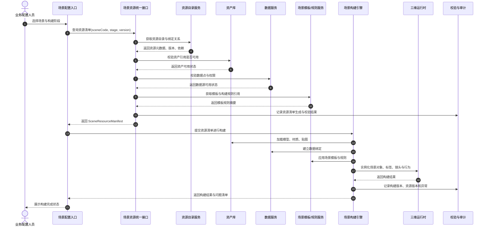

# 场景资源统一接口概要设计

## 1. 设计目标

本模块用于规范“场景构建所需资源”的概念，并设计一个轻量统一接口，支撑未来的场景自动化构建。

本设计不追求一次性覆盖完整数字孪生平台，只先解决以下问题：

- 场景构建中的“资源”如何定义。
- 资源与资产、数据、组件、接口之间如何区分。
- 场景自动化构建需要哪些最小资源信息。
- 统一接口应该输出什么，不应该承担什么。
- 系统边界、调用顺序和核心机制如何表达。

## 2. 核心概念规范

### 2.1 通用定义

在本设计中，**资源 Resource** 是指：被系统消费以完成某个构建、渲染、绑定、运行或展示动作的可识别输入。

资源不等于文件，也不等于数据。资源是对文件、数据、服务、规则、脚本、模板或配置的统一描述。

一个资源至少应回答：

- 它是什么。
- 从哪里获得。
- 用在什么场景。
- 绑定到哪个对象。
- 当前是否可用。
- 使用哪个版本。
- 依赖哪些其他资源。

### 2.2 场景资源定义

**场景资源 Scene Resource** 是数字孪生场景构建过程中，被场景构建引擎消费的资源描述。

它可以指向：

- 三维模型。
- 材质贴图。
- 设备或构筑物对象。
- 空间位置与姿态。
- 数据源或点位。
- UI 标签或指标卡片。
- 镜头路径。
- 行为脚本。
- 场景模板。
- 构建规则。

场景资源的本质不是“素材仓库里的文件”，而是“场景自动化构建需要消费的一条标准化输入”。

### 2.3 相关概念边界

| 概念 | 定义 | 与场景资源的关系 |
| --- | --- | --- |
| 资产 Asset | 可复用的原始或加工素材，如模型、贴图、图标、脚本文件 | 资产是资源可能引用的实体 |
| 数据 Data | 设备、指标、状态、告警、业务字段等运行信息 | 数据是资源可能引用的动态来源 |
| 组件 Component | 可被场景复用的前端、三维或交互单元 | 组件是资源可能驱动或实例化的对象 |
| 模板 Template | 定义构建规则、布局规则或默认表现方式 | 模板用于解释资源如何参与构建 |
| 场景资源 Scene Resource | 面向场景构建的标准化资源描述 | 对资产、数据、组件、模板进行统一引用和绑定 |

## 3. 设计边界

### 3.1 本接口负责什么

统一资源接口只负责提供“场景构建资源清单”。

它负责：

- 输出某个场景需要哪些资源。
- 说明资源类型、用途、来源、版本和状态。
- 说明资源与孪生对象、空间位置、图层、UI 或行为的绑定关系。
- 说明资源之间的依赖关系。
- 支持构建前校验资源是否齐备。

### 3.2 本接口不负责什么

本接口不直接负责：

- 存储大体量模型文件。
- 下载或转换模型文件。
- 执行三维场景构建。
- 决定所有视觉表现细节。
- 替代数据接口、资产库接口或模型管理接口。
- 直接控制设备或生产系统。

这些能力应由资产库、数据服务、模板服务、场景构建引擎和运行时系统分别承担。

## 4. 总体设计思路

未来场景自动化构建不应让构建引擎到处找素材、查数据、猜绑定关系。

合理方式是先形成一份标准化的**场景资源清单 Scene Resource Manifest**。

场景构建引擎拿到资源清单后，再按清单完成：

1. 资源解析。
2. 依赖校验。
3. 资产加载。
4. 数据绑定。
5. 模板应用。
6. 场景实例化。
7. 构建结果检查。

统一接口的核心输出不是单个资源，而是一份可被自动化构建流程消费的资源清单。

## 5. 核心对象

### 5.1 场景资源清单

`SceneResourceManifest` 表示某个场景在某个版本下的资源集合。

| 字段 | 说明 |
| --- | --- |
| manifestId | 资源清单唯一标识 |
| sceneCode | 场景编码 |
| sceneName | 场景名称 |
| sceneVersion | 场景版本 |
| buildStage | 构建阶段，如 poc、demo、prod |
| resources | 资源列表 |
| validation | 资源校验结果 |
| generatedAt | 清单生成时间 |

### 5.2 场景资源

`SceneResource` 表示一条可被构建引擎消费的资源描述。

| 字段 | 说明 |
| --- | --- |
| resourceId | 资源唯一标识 |
| resourceType | 资源类型 |
| resourceName | 资源名称 |
| buildRole | 在场景构建中的作用 |
| locator | 资源位置或获取方式 |
| version | 资源版本 |
| binding | 绑定关系 |
| dependencies | 依赖资源 |
| status | 当前状态 |

### 5.3 绑定关系

`ResourceBinding` 表示资源应该绑定到哪里。

| 字段 | 说明 |
| --- | --- |
| twinObjectId | 孪生对象 ID |
| spatialAnchor | 空间锚点或坐标参考 |
| layer | 场景图层 |
| slot | 组件槽位，如 model、label、panel、script |
| transform | 位置、旋转、缩放 |
| dataPointRefs | 绑定的数据点或指标 |

## 6. 资源类型建议

当前阶段先定义最小资源类型，不一次性扩展过多。

| 类型 | 说明 | 示例 |
| --- | --- | --- |
| `scene_template` | 场景模板 | 工厂总览模板、设备详情模板 |
| `asset_3d` | 三维模型资产 | 厌氧罐模型、厂房模型 |
| `material_texture` | 材质与贴图 | 金属材质、水体贴图 |
| `twin_object` | 孪生对象定义 | 设备、构筑物、区域 |
| `data_source` | 数据源或点位 | 液位、温度、运行状态 |
| `ui_overlay` | UI 标签或指标卡片 | 设备状态卡、区域名称牌 |
| `camera_path` | 镜头路径 | 总览到局部设备推进镜头 |
| `behavior_script` | 行为脚本 | 高亮、闪烁、告警联动 |
| `build_rule` | 构建规则 | 设备标签自动挂载规则 |

## 7. 接口概要设计

### 7.1 资源清单查询接口

```text
GET /api/scene-resource-manifests/{sceneCode}
```

用途：查询某个场景在指定阶段和版本下的资源清单。

建议查询参数：

| 参数 | 说明 |
| --- | --- |
| stage | 构建阶段，如 poc、demo、prod |
| version | 场景版本，默认 latest |
| includeValidation | 是否包含校验结果 |

### 7.2 资源清单校验接口

```text
POST /api/scene-resource-manifests/{manifestId}/validate
```

用途：在自动构建前检查资源是否齐备、版本是否一致、绑定关系是否完整。

校验重点：

- 必需资源是否缺失。
- 资源版本是否可用。
- 资源 locator 是否可解析。
- 绑定对象是否存在。
- 数据点是否可访问。
- 依赖关系是否完整。

### 7.3 单资源元数据查询接口

```text
GET /api/scene-resources/{resourceId}
```

用途：查询单个资源的元数据和使用状态。

该接口用于排查问题，不作为场景自动化构建的主入口。

## 8. 返回结构示例

```json
{
  "manifestId": "manifest-xinqi-main-poc-v001",
  "sceneCode": "xinqi-main",
  "sceneName": "宜兴新奇环保整体场景",
  "sceneVersion": "v0.1",
  "buildStage": "poc",
  "resources": [
    {
      "resourceId": "asset-anaerobic-tank-001",
      "resourceType": "asset_3d",
      "resourceName": "厌氧罐三维模型",
      "buildRole": "primary-equipment-model",
      "locator": {
        "type": "asset_store",
        "uri": "asset://models/anaerobic-tank/v001"
      },
      "version": "v001",
      "binding": {
        "twinObjectId": "device-anaerobic-tank-01",
        "layer": "process-equipment",
        "slot": "model",
        "transform": {
          "position": [0, 0, 0],
          "rotation": [0, 0, 0],
          "scale": [1, 1, 1]
        }
      },
      "dependencies": [
        "material-metal-001"
      ],
      "status": "ready"
    },
    {
      "resourceId": "datapoint-anaerobic-tank-status",
      "resourceType": "data_source",
      "resourceName": "厌氧罐运行状态",
      "buildRole": "equipment-status-binding",
      "locator": {
        "type": "data_service",
        "uri": "data://points/anaerobic-tank/status"
      },
      "version": "latest",
      "binding": {
        "twinObjectId": "device-anaerobic-tank-01",
        "slot": "status-card",
        "dataPointRefs": [
          "anaerobic_tank_status",
          "anaerobic_tank_level"
        ]
      },
      "dependencies": [],
      "status": "ready"
    }
  ],
  "validation": {
    "status": "passed",
    "missingResources": [],
    "warnings": []
  },
  "generatedAt": "2026-04-17T00:00:00+08:00"
}
```

## 9. 系统序列图

以下 Mermaid 可在 Obsidian 中预览。



## 10. 设计边界说明

| 边界 | 说明 |
| --- | --- |
| 资源接口与资产库 | 资源接口只描述资产引用，不保存大文件 |
| 资源接口与数据服务 | 资源接口只描述数据绑定，不直接提供实时数据流 |
| 资源接口与构建引擎 | 资源接口输出清单，构建引擎负责解释和实例化 |
| 资源接口与模板服务 | 资源接口引用模板和规则，不直接承载复杂模板逻辑 |
| 资源接口与运行时 | 运行时负责渲染、交互和状态更新，资源接口不参与实时渲染 |

## 11. 核心机制要素

### 11.1 资源目录

资源目录维护资源的基础信息，包括资源 ID、类型、名称、来源、版本、状态和负责人。

它是资源清单生成的基础。

### 11.2 资源清单

资源清单是自动化构建的主输入。

一个场景构建任务只应依赖一份明确版本的资源清单，避免构建过程中临时拼装资源。

### 11.3 绑定机制

绑定机制用于说明资源与孪生对象、空间位置、图层、UI 槽位、数据点之间的关系。

自动化构建能否成立，关键不在于是否有模型文件，而在于资源能否正确绑定。

### 11.4 校验机制

构建前必须校验资源是否可用。

最小校验包括：

- 必需资源是否存在。
- 资源 locator 是否可解析。
- 版本是否可用。
- 依赖是否完整。
- 绑定对象是否存在。
- 数据点是否可访问。

### 11.5 版本机制

资源、资源清单和场景构建结果都应具备版本。

版本机制用于支持：

- POC 版本冻结。
- 演示版本复现。
- 构建问题追溯。
- 后续资产替换和场景升级。

### 11.6 审计机制

每次资源清单生成和场景构建都应记录：

- 使用了哪个资源清单。
- 使用了哪些资源版本。
- 哪些资源缺失或异常。
- 构建结果是否成功。
- 构建任务由谁触发。

## 12. 自动化构建最小闭环

未来要实现“场景自动化构建”，至少需要形成以下闭环：

```text
场景定义 -> 资源清单 -> 资源校验 -> 场景构建 -> 构建结果 -> 问题回写
```

其中，本模块只覆盖：

```text
资源清单 -> 资源校验
```

不直接覆盖完整构建引擎实现。

## 13. 验收口径

本概要设计通过的判断标准：

- “资源”概念已与资产、数据、组件、模板区分清楚。
- 能说明场景自动化构建为什么需要资源清单。
- 能说明统一接口的责任边界。
- Mermaid 序列图能在 Obsidian 中预览。
- 接口对象和字段足够支撑后续开发验证。
- 未把接口设计扩展成完整平台建设方案。

## 14. 待确认问题

| 问题 | 影响 |
| --- | --- |
| 现有三维资产是否已有统一资产编号 | 影响 resourceId 和 locator 设计 |
| 现有设备或构筑物是否已有孪生对象 ID | 影响 binding.twinObjectId |
| 数据点位是否已有稳定编码 | 影响 dataPointRefs |
| 场景模板是否由 UE、Web 三维还是后端规则服务承载 | 影响 scene_template 和 build_rule 的实现 |
| 自动化构建优先面向 POC 演示还是生产运行 | 影响校验严格度和版本冻结策略 |
