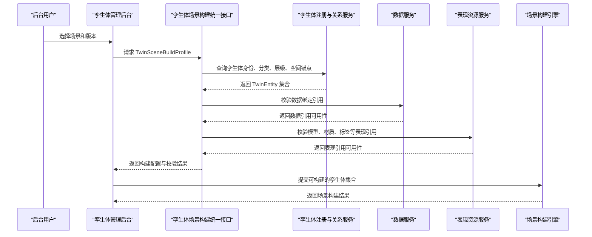

# 孪生体场景构建统一接口概要设计

## 1. 设计目标

本模块用于设计一个轻量统一后台接口，支撑孪生场景搭建过程中对孪生体构建单元的一元化管理。

本阶段先解决以下问题：

- 什么是本模块的最小管理单元。
- 孪生体与资源、资产、数据、组件之间如何区分。
- 后台统一接口需要输出哪些最小信息，才能支撑未来场景自动化构建。
- 本模块负责什么，不负责什么。
- 系统调用顺序和设计边界如何表达。

## 2. 核心概念规范

### 2.1 孪生体定义

**孪生体 Digital Twin Entity** 是现实对象、空间、设备、系统或过程在数字孪生系统中的可识别映射对象。

在本模块中，孪生体是孪生场景搭建的最小管理单元。它通常具备稳定身份、分类、层级关系、空间定位、数据绑定、状态表达和表现引用。

### 2.2 资源定义

**资源 Resource** 是被系统消费以完成构建、渲染、绑定、运行或展示动作的可识别输入。

在本模块中，资源不是主对象。资源、资产、贴图、动画、材质、脚本和 UI 覆盖物只作为孪生体的依赖引用存在。

### 2.3 孪生体与资源关系

二者关系如下：

- 孪生体是场景构建和后台管理的目标对象。
- 资源是支撑孪生体被构建、渲染、绑定、运行或展示的输入。
- 一个孪生体可以引用多个资源，如模型、材质、数据点、标签、脚本和规则。
- 一个资源可以被多个孪生体复用，如通用阀门模型、统一状态标签模板。
- 本模块只保存资源引用和绑定意图，不负责资源库、贴图库、动画库或模型文件管理。

| 维度 | 孪生体 Digital Twin Entity | 资源 Resource |
| --- | --- | --- |
| 核心角色 | 场景构建的最小管理单元 | 构建和呈现孪生体所需的依赖输入 |
| 关注重点 | 身份、分类、层级、空间、数据、状态、表现引用 | 类型、来源、版本、用途、可用性 |
| 生命周期 | 随业务对象持续存在和演进 | 随构建版本、展示方案或素材更新变化 |
| 标识方式 | `twinId`、设备编码、空间编码、业务对象编码 | `resourceId`、资产 URI、数据点编码 |
| 与场景关系 | 被实例化、定位、监测和交互 | 被加载、解析、绑定或校验 |
| 示例 | 厌氧罐、厂区、管线、设备组、生产过程 | 三维模型、材质、点位、UI 标签、镜头路径、构建规则 |

## 3. 设计边界

### 3.1 本模块负责

- 管理孪生体身份、名称、分类和业务编码。
- 管理孪生体父子层级、场景归属和空间锚点。
- 管理孪生体的数据绑定引用。
- 管理孪生体的表现资源引用。
- 输出场景构建所需的孪生体集合。
- 校验孪生体构建所需的关键引用是否齐备。

### 3.2 本模块不负责

- 存储大体量模型文件。
- 管理贴图、动画、材质、脚本等资源库。
- 转换模型文件格式。
- 执行三维场景渲染。
- 直接控制设备或生产系统。
- 替代数据平台、资产库、模型服务或场景运行时。

## 4. 核心对象

### 4.1 孪生场景构建配置

`TwinSceneBuildProfile` 表示某个场景在某个版本下需要构建的孪生体集合。

| 字段 | 说明 |
| --- | --- |
| profileId | 构建配置唯一标识 |
| sceneCode | 场景编码 |
| sceneName | 场景名称 |
| sceneVersion | 场景版本 |
| buildStage | 构建阶段，如 poc、demo、prod |
| twins | 孪生体集合 |
| validation | 构建校验结果 |
| generatedAt | 配置生成时间 |

### 4.2 孪生体

`TwinEntity` 表示一个可被后台管理和场景构建消费的孪生体。

| 字段 | 说明 |
| --- | --- |
| twinId | 孪生体唯一标识 |
| twinType | 孪生体类型，如 site、area、device、pipeline、process |
| twinName | 孪生体名称 |
| businessCode | 业务编码、设备编码或空间编码 |
| parentTwinId | 上级孪生体标识 |
| sceneCode | 所属场景 |
| spatialAnchor | 空间锚点、坐标或位置参考 |
| dataBindings | 数据绑定引用 |
| presentationRefs | 表现资源引用 |
| buildState | 构建状态 |
| status | enabled、disabled、draft |

### 4.3 数据绑定

`TwinDataBinding` 表示孪生体与数据服务之间的绑定关系。

| 字段 | 说明 |
| --- | --- |
| sourceType | 数据来源类型，如 iot、business、manual、derived |
| sourceRef | 数据源或服务引用 |
| dataPointRefs | 点位、指标或状态字段引用 |
| updateMode | 更新方式，如 realtime、scheduled、manual |
| required | 构建或运行时是否必需 |

### 4.4 表现引用

`TwinPresentationRef` 表示孪生体对模型、材质、动画、标签等外部表现资源的引用。

| 字段 | 说明 |
| --- | --- |
| modelRef | 三维模型引用 |
| materialRefs | 材质或贴图引用 |
| animationRefs | 动画引用 |
| labelRef | 标签或名称牌引用 |
| uiOverlayRefs | 指标卡片、状态面板等 UI 覆盖物引用 |
| behaviorRefs | 高亮、告警、联动等行为引用 |

说明：上述字段只保存引用，不在本模块内维护资源实体。

### 4.5 构建状态

`TwinBuildState` 表示孪生体是否具备被自动化构建消费的条件。

| 字段 | 说明 |
| --- | --- |
| readiness | ready、partial、blocked |
| missingItems | 缺失的关键绑定或引用 |
| warnings | 不阻断构建但需要关注的问题 |
| errors | 阻断构建的问题 |
| checkedAt | 最近一次校验时间 |

## 5. 接口概要设计

### 5.1 孪生场景构建配置查询

```text
GET /api/twin-scene-build-profiles/{sceneCode}
```

用途：查询某个场景在指定阶段和版本下需要构建的孪生体集合。

建议查询参数：

| 参数 | 说明 |
| --- | --- |
| stage | 构建阶段，如 poc、demo、prod |
| version | 场景版本，默认 latest |
| includeValidation | 是否包含校验结果 |

### 5.2 孪生体详情查询

```text
GET /api/twin-entities/{twinId}
```

用途：查询单个孪生体的身份、层级、空间、数据绑定和表现引用。

### 5.3 构建配置校验

```text
POST /api/twin-scene-build-profiles/{profileId}/validate
```

用途：在自动化构建前检查孪生体集合是否具备构建条件。

校验重点：

- 孪生体身份和分类是否完整。
- 父子层级是否可解析。
- 空间锚点是否可用。
- 必需数据点是否可访问。
- 必需表现引用是否存在。
- 构建阻断问题是否已消除。

## 6. 返回结构示例

```json
{
  "profileId": "profile-xinqi-main-poc-v001",
  "sceneCode": "xinqi-main",
  "sceneName": "宜兴新奇环保整体场景",
  "sceneVersion": "v0.1",
  "buildStage": "poc",
  "twins": [
    {
      "twinId": "device-anaerobic-tank-01",
      "twinType": "device",
      "twinName": "厌氧罐 1 号",
      "businessCode": "EQ-ANAEROBIC-TANK-01",
      "parentTwinId": "area-biochemical-01",
      "sceneCode": "xinqi-main",
      "spatialAnchor": {
        "type": "scene-coordinate",
        "position": [0, 0, 0],
        "rotation": [0, 0, 0],
        "scale": [1, 1, 1]
      },
      "dataBindings": [
        {
          "sourceType": "iot",
          "sourceRef": "data://points/anaerobic-tank",
          "dataPointRefs": [
            "anaerobic_tank_status",
            "anaerobic_tank_level"
          ],
          "updateMode": "realtime",
          "required": true
        }
      ],
      "presentationRefs": {
        "modelRef": "asset://models/anaerobic-tank/v001",
        "materialRefs": [
          "asset://materials/metal/v001"
        ],
        "labelRef": "ui://labels/equipment-nameplate/v001",
        "uiOverlayRefs": [
          "ui://cards/equipment-status/v001"
        ]
      },
      "buildState": {
        "readiness": "ready",
        "missingItems": [],
        "warnings": [],
        "errors": [],
        "checkedAt": "2026-04-17T10:00:00+08:00"
      },
      "status": "enabled"
    }
  ],
  "validation": {
    "readiness": "ready",
    "blockedCount": 0,
    "partialCount": 0
  },
  "generatedAt": "2026-04-17T10:00:00+08:00"
}
```

## 7. 系统序列图



## 8. 核心机制

### 8.1 以孪生体为中心聚合

统一接口以 `TwinEntity` 聚合场景构建所需信息，避免构建引擎分别从设备台账、空间数据、点位表、资源库和 UI 配置中拼装对象。

### 8.2 引用不等于托管

本模块只维护数据绑定和表现资源的引用关系。实际数据、模型、贴图、动画、材质和脚本仍由外部系统或后续独立模块管理。

### 8.3 构建前校验

构建前必须校验身份、层级、空间、数据绑定和表现引用。校验结果只判断是否可构建，不替代数据质量治理、资源质量治理或运行时监控。

## 9. 当前不展开内容

- 资源库管理后台。
- 贴图、材质、动画的版本体系。
- 三维模型转换流水线。
- 场景运行时交互协议。
- 设备控制接口。
- 完整主数据治理平台。

## 10. 待确认问题

- 孪生体唯一标识由哪个系统产生。
- 设备、区域、管线、工艺过程是否共用同一孪生体类型体系。
- POC 阶段是否只覆盖重点展示区域内的孪生体。
- 数据点位与孪生体的绑定关系由现有平台提供，还是在本模块中维护映射表。
- 表现资源服务是否已经存在；如不存在，是否后续拆分“场景表现资源管理”模块。
