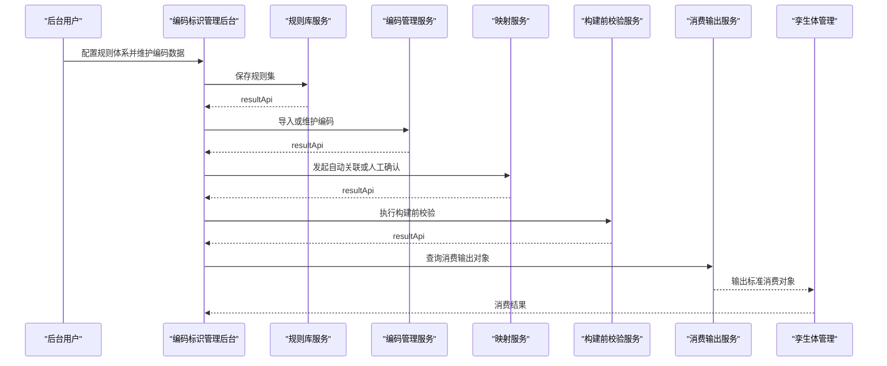

# 编码标识管理

> 本文档同时承担“模块主文档”和“模块接口总览”两种职责，不再单独维护独立的模块总览接口设计文档。

## 1. 模块定位

本模块用于建立工业标准编码从物理标识到数字模型对象的统一识别入口，并为后续场景自动化构建生成提供翻译、映射、验码和消费输出能力。

本模块的核心职责是：作为工业标准编码的“翻译官”与“验码器”，建立物理标识与数字模型之间的桥梁。

## 2. 生命周期材料

| 阶段 | 文档 | 状态 | 说明 |
| --- | --- | --- | --- |
| 规划 | [[PLAN-V001-数字孪生数据基座一期计划]] | draft | 数据基座场景自动化构建计划 |
| 任务 | [[../../10-管理/20-任务/数据基座-编码标识管理-TASK-0001-编码规则库管理功能-26.0422]] | open | 覆盖规则库管理功能的设计确认、GUI 实现和规则试运行能力 |
| 任务 | [[../../10-管理/20-任务/数据基座-编码标识管理-TASK-0002-编码管理功能-26.0422]] | open | 覆盖编码数据管理、批量导入、智能校验和清洗能力 |
| 任务 | [[../../10-管理/20-任务/数据基座-编码标识管理-TASK-0003-编码映射与自动关联功能-26.0422]] | open | 覆盖映射维护、候选建议、自动关联和人工确认能力 |
| 任务 | [[../../10-管理/20-任务/数据基座-编码标识管理-TASK-0004-编码试运行与构建前校验功能-26.0422]] | open | 覆盖样本试运行、构建前校验和异常处理能力 |
| 任务 | [[../../10-管理/20-任务/数据基座-编码标识管理-TASK-0005-编码消费输出服务-26.0422]] | open | 覆盖统一消费输出对象、结果封装和后续模块消费接口 |

## 3. 当前结论

当前编码标识管理模块聚焦三个核心问题：

- 哪些对象必须被统一编码识别。
- 物理标识如何翻译成数字模型对象。
- 哪些校验规则决定对象能否进入后续场景生成链路。

当前为支撑后续数字孪生场景自动化生成，模块基础功能闭环应至少包括：

- 规则库管理：管理 `KKS` 等编码体系、解析逻辑、校验正则、语义映射、规则启停和试运行。
- 编码管理：管理编码数据的增删改查、批量导入、智能校验、清洗和冲突识别。
- 编码映射：管理标识与孪生体之间的映射关系，支持候选建议、自动关联和人工确认。
- 构建前校验与异常处理：识别阻断项、警告项和异常样本，为后续构建链路提供准入判断。
- 消费输出：向孪生体管理和场景生成链路输出统一对象、映射结果和校验结果。

## 4. 设计边界

### 4.1 本模块负责

- 管理 `KKS` 等编码体系、解析逻辑、校验正则和语义映射规则。
- 管理编码数据的增删改查、批量导入、智能校验与清洗。
- 管理编码标识与孪生体之间的映射关系，并支持自动关联。
- 提供试运行、构建前校验和异常记录能力。
- 输出可被孪生体管理和场景自动化生成链路消费的标准结果。

### 4.2 本模块不负责

- 工业编码标准本体维护。
- 第三方平台内部规则改造。
- 场景生成引擎实现。
- 版本管理与历史回滚。
- 性能优化与运行时治理。

## 5. 核心概念定义

### 5.1 编码体系 Code System

编码体系是规则库中的最上层对象，用于标识一类工业编码标准及其适用范围，例如 `KKS`。

### 5.2 规则集 Rule Set

规则集是围绕某一编码体系配置的一组可执行规则，至少包括解析规则、校验规则和语义映射规则。

### 5.3 编码记录 Code Record

编码记录是被系统管理的具体编码数据，包含编码值、来源、对象类型、状态和质量信息。

### 5.4 编码映射 Code Mapping

编码映射是编码标识与孪生体对象之间的对应关系，包含手工绑定、自动关联候选、确认状态和冲突状态。

### 5.5 构建前校验 Precheck

构建前校验是面向后续场景自动化生成的准入检查，用于判断编码对象是否可以进入后续消费链路。

### 5.6 消费输出对象 Consumption Payload

消费输出对象是编码标识管理模块对外提供的标准结果，统一封装编码基础信息、映射结果和校验结果。

## 6. 统一响应规范

编码标识管理模块全部接口统一使用 `resultApi`。

### 6.1 通用响应体

```json
{
  "code": 200,
  "msg": "操作成功",
  "data": {}
}
```

### 6.2 分页响应体

```json
{
  "total": 100,
  "rows": [],
  "code": 200,
  "msg": "查询成功"
}
```

## 7. 状态码规范

| 状态码 | 常量名 | 说明 |
| --- | --- | --- |
| `200` | `SUCCESS` | 操作成功 |
| `201` | `CREATED` | 对象创建成功 |
| `202` | `ACCEPTED` | 请求已接受 |
| `204` | `NO_CONTENT` | 操作成功但无返回数据 |
| `301` | `MOVED_PERM` | 资源已移除 |
| `303` | `SEE_OTHER` | 重定向 |
| `304` | `NOT_MODIFIED` | 资源未修改 |
| `400` | `BAD_REQUEST` | 参数错误 |
| `401` | `UNAUTHORIZED` | 未授权 |
| `403` | `FORBIDDEN` | 访问受限或授权过期 |
| `404` | `NOT_FOUND` | 资源或服务未找到 |
| `405` | `BAD_METHOD` | 不允许的 HTTP 方法 |
| `409` | `CONFLICT` | 资源冲突或被锁 |
| `415` | `UNSUPPORTED_TYPE` | 不支持的媒体类型 |
| `500` | `ERROR` | 系统内部错误 |
| `501` | `NOT_IMPLEMENTED` | 接口未实现 |
| `601` | `WARN` | 系统警告消息 |

## 8. 功能接口设计

| 功能 | 接口设计文档 | 说明 |
| --- | --- | --- |
| 规则库管理 | [[编码规则库管理功能-接口设计-V001-0422]] | 定义编码体系、规则集、启停和样本试运行接口 |
| 编码管理 | [[编码管理功能-接口设计-V001-0422]] | 定义编码 CRUD、批量导入、清洗建议和导入结果接口 |
| 编码映射与自动关联 | [[编码映射与自动关联功能-接口设计-V001-0422]] | 定义候选建议、自动关联、人工确认和解绑定接口 |
| 编码试运行与构建前校验 | [[编码试运行与构建前校验功能-接口设计-V001-0422]] | 定义试解析、试验码、构建前校验和人工复核接口 |
| 编码消费输出 | [[编码消费输出服务-接口设计-V001-0422]] | 定义统一消费对象和面向下游的消费视图接口 |

## 9. 模块级数据字典

说明：

- `resultApi` 与分页响应体已在系统代码中统一实现，本节不再重复展开。
- 下列业务对象默认继承统一审计字段。
- 表名前缀统一使用 `z_`。

### 9.1 CodeSystem

| 字段 | 类型 | 必填 | 说明 | 映射关系 |
| --- | --- | --- | --- | --- |
| `systemId` | string | 是 | 编码体系主键 | `z_code_system.system_id` |
| `systemCode` | string | 是 | 编码体系标识 | `z_code_system.system_code` |
| `systemName` | string | 是 | 编码体系名称 | `z_code_system.system_name` |
| `status` | string | 是 | 编码体系状态 | `z_code_system.status` |
| `subjectTypes` | array<string> | 否 | 适用对象类型列表 | `z_code_system.subject_types` |
| `createdBy` | string | 否 | 创建人 | `z_code_system.created_by` |
| `createdTime` | datetime/string | 否 | 创建时间 | `z_code_system.created_time` |
| `updatedBy` | string | 否 | 更新人 | `z_code_system.updated_by` |
| `updatedTime` | datetime/string | 否 | 更新时间 | `z_code_system.updated_time` |
| `deletedFlag` | integer | 否 | 删除标记 | `z_code_system.deleted_flag` |

### 9.2 CodeRecord

| 字段 | 类型 | 必填 | 说明 | 映射关系 |
| --- | --- | --- | --- | --- |
| `codeId` | string | 是 | 编码记录主键 | `z_code_record.code_id` |
| `codeValue` | string | 是 | 编码原值 | `z_code_record.code_value` |
| `systemCode` | string | 是 | 所属编码体系 | `z_code_record.system_code` |
| `subjectType` | string | 是 | 对象类型 | `z_code_record.subject_type` |
| `status` | string | 是 | 编码状态 | `z_code_record.status` |
| `source` | string | 否 | 数据来源 | `z_code_record.source` |
| `createdBy` | string | 否 | 创建人 | `z_code_record.created_by` |
| `createdTime` | datetime/string | 否 | 创建时间 | `z_code_record.created_time` |
| `updatedBy` | string | 否 | 更新人 | `z_code_record.updated_by` |
| `updatedTime` | datetime/string | 否 | 更新时间 | `z_code_record.updated_time` |
| `deletedFlag` | integer | 否 | 删除标记 | `z_code_record.deleted_flag` |

### 9.3 CodeMapping

| 字段 | 类型 | 必填 | 说明 | 映射关系 |
| --- | --- | --- | --- | --- |
| `mappingId` | string | 是 | 映射关系主键 | `z_code_mapping.mapping_id` |
| `codeId` | string | 是 | 编码记录 ID | `z_code_mapping.code_id` |
| `twinId` | string | 否 | 关联孪生体 ID | `z_code_mapping.twin_id` |
| `mappingStatus` | string | 是 | 映射状态 | `z_code_mapping.mapping_status` |
| `matchReasons` | array<string> | 否 | 命中原因 | `z_code_mapping.match_reasons` |
| `createdBy` | string | 否 | 创建人 | `z_code_mapping.created_by` |
| `createdTime` | datetime/string | 否 | 创建时间 | `z_code_mapping.created_time` |
| `updatedBy` | string | 否 | 更新人 | `z_code_mapping.updated_by` |
| `updatedTime` | datetime/string | 否 | 更新时间 | `z_code_mapping.updated_time` |
| `deletedFlag` | integer | 否 | 删除标记 | `z_code_mapping.deleted_flag` |

### 9.4 PrecheckRecord

| 字段 | 类型 | 必填 | 说明 | 映射关系 |
| --- | --- | --- | --- | --- |
| `recordId` | string | 是 | 校验记录主键 | `z_precheck_record.record_id` |
| `target` | string | 是 | 校验目标 | `z_precheck_record.target` |
| `passedCount` | integer | 否 | 通过数量 | `z_precheck_record.passed_count` |
| `warningCount` | integer | 否 | 警告数量 | `z_precheck_record.warning_count` |
| `blockedCount` | integer | 否 | 阻断数量 | `z_precheck_record.blocked_count` |
| `reviewStatus` | string | 否 | 复核状态 | `z_precheck_record.review_status` |
| `createdBy` | string | 否 | 创建人 | `z_precheck_record.created_by` |
| `createdTime` | datetime/string | 否 | 创建时间 | `z_precheck_record.created_time` |
| `updatedBy` | string | 否 | 更新人 | `z_precheck_record.updated_by` |
| `updatedTime` | datetime/string | 否 | 更新时间 | `z_precheck_record.updated_time` |
| `deletedFlag` | integer | 否 | 删除标记 | `z_precheck_record.deleted_flag` |

### 9.5 ConsumptionPayload

| 字段 | 类型 | 必填 | 说明 | 映射关系 |
| --- | --- | --- | --- | --- |
| `codeId` | string | 是 | 编码记录 ID | `z_consumption_payload_snapshot.code_id` |
| `codeValue` | string | 是 | 编码值 | `z_consumption_payload_snapshot.code_value` |
| `subjectType` | string | 是 | 对象类型 | `z_consumption_payload_snapshot.subject_type` |
| `mapping` | object | 否 | 映射结果 | 运行态聚合对象 |
| `verification` | object | 否 | 校验结果 | 运行态聚合对象 |
| `createdBy` | string | 否 | 创建人 | `z_consumption_payload_snapshot.created_by` |
| `createdTime` | datetime/string | 否 | 创建时间 | `z_consumption_payload_snapshot.created_time` |
| `updatedBy` | string | 否 | 更新人 | `z_consumption_payload_snapshot.updated_by` |
| `updatedTime` | datetime/string | 否 | 更新时间 | `z_consumption_payload_snapshot.updated_time` |
| `deletedFlag` | integer | 否 | 删除标记 | `z_consumption_payload_snapshot.deleted_flag` |

## 10. 模块级数据库表设计示例

### 10.1 表关系总览

| 表名 | 用途 | 关键字段 | 关系说明 |
| --- | --- | --- | --- |
| `z_code_system` | 编码体系主表 | `system_id` `system_code` | 规则库入口表，被 `z_code_rule_set` 和 `z_code_record` 引用 |
| `z_code_rule_set` | 规则集表 | `rule_set_id` `system_id` | 归属某一编码体系，承载解析、校验和语义映射规则 |
| `z_code_record` | 编码记录表 | `code_id` `system_code` | 编码主数据表，被映射、校验和消费输出引用 |
| `z_code_import_batch` | 导入批次表 | `batch_id` | 记录批量导入结果和问题清单 |
| `z_code_mapping` | 编码映射表 | `mapping_id` `code_id` `twin_id` | 维护编码与孪生体的桥接关系 |
| `z_precheck_record` | 构建前校验记录表 | `record_id` | 记录准入检查结果和人工复核状态 |
| `z_consumption_payload_snapshot` | 消费输出快照表 | `snapshot_id` `code_id` | 统一沉淀对下游可消费的标准结果 |

### 10.2 表关系说明

- `z_code_system.system_code` 对应 `z_code_record.system_code`，用于保证编码记录归属明确的编码体系。
- `z_code_system.system_id` 对应 `z_code_rule_set.system_id`，用于挂载规则配置。
- `z_code_record.code_id` 对应 `z_code_mapping.code_id`，用于建立编码与孪生体的桥接关系。
- `z_code_record.code_id` 可被 `z_precheck_record.code_ids_json` 和 `z_consumption_payload_snapshot.code_id` 引用，用于校验与输出。
- `z_code_mapping.twin_id` 关联外部孪生体管理模块主键，本模块只保存引用，不维护孪生体实体表。

## 11. 模块总序列图


