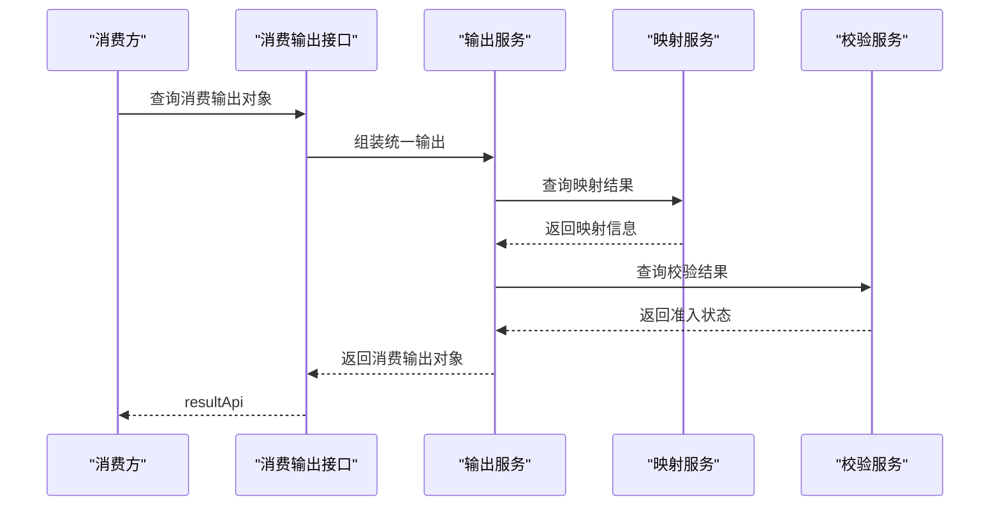

# 编码消费输出服务接口设计

## 1. 设计目标

本功能用于对外提供统一消费对象，把编码基础信息、映射结果和校验结果以稳定结构输出给孪生体管理和场景自动化生成链路。

## 2. 核心概念

### 2.1 消费输出对象 Consumption Payload

消费输出对象是供后续模块消费的统一结构，不暴露规则库和内部维护过程细节。

### 2.2 输出视图 Output View

输出视图表示同一编码对象面向不同消费端的组织方式，例如孪生体消费视图和场景构建消费视图。

### 2.3 输出快照 Output Snapshot

输出快照表示一次查询返回的稳定结果，用于消费方按统一字段读取。

## 3. 接口清单

| 接口 | 方法 | 用途 |
| --- | --- | --- |
| `/api/code-management/outputs/{codeId}` | `GET` | 查询单个编码消费输出对象 |
| `/api/code-management/outputs/batch` | `POST` | 批量查询消费输出对象 |
| `/api/code-management/outputs/{codeId}/twin-view` | `GET` | 查询孪生体消费视图 |
| `/api/code-management/outputs/{codeId}/scene-view` | `GET` | 查询场景构建消费视图 |

## 4. 关键接口设计

### 4.1 查询单个编码消费输出对象

```text
GET /api/code-management/outputs/{codeId}
```

响应体示例：

```json
{
  "code": 200,
  "msg": "操作成功",
  "data": {
    "codeId": "CODE-0001",
    "codeValue": "WTG-A01-001",
    "subjectType": "device",
    "mapping": {
      "mappingStatus": "confirmed",
      "twinId": "TWIN-1001"
    },
    "verification": {
      "status": "passed",
      "warnings": []
    }
  }
}
```

### 4.2 批量查询消费输出对象

```text
POST /api/code-management/outputs/batch
```

请求体示例：

```json
{
  "codeIds": ["CODE-0001", "CODE-0002"]
}
```

响应体示例：

```json
{
  "code": 200,
  "msg": "操作成功",
  "data": {
    "items": [
      {
        "codeId": "CODE-0001",
        "mappingStatus": "confirmed",
        "verificationStatus": "passed"
      }
    ]
  }
}
```

### 4.3 查询场景构建消费视图

```text
GET /api/code-management/outputs/{codeId}/scene-view
```

响应体示例：

```json
{
  "code": 200,
  "msg": "操作成功",
  "data": {
    "codeId": "CODE-0001",
    "objectType": "device",
    "businessCode": "WTG-A01-001",
    "mappedTwinId": "TWIN-1001",
    "buildReady": true,
    "warnings": []
  }
}
```

## 5. 关键对象

| 对象 | 字段 | 说明 |
| --- | --- | --- |
| `ConsumptionPayload` | `codeId` `codeValue` `subjectType` | 基础消费对象 |
| `TwinView` | `mappedTwinId` `mappingStatus` | 孪生体消费视图 |
| `SceneView` | `buildReady` `warnings` | 场景构建消费视图 |

## 6. 字段级数据字典

### 6.1 ConsumptionPayload

| 字段 | 类型 | 必填 | 说明 | 映射关系 |
| --- | --- | --- | --- | --- |
| `codeId` | string | 是 | 编码记录 ID | `z_consumption_payload_snapshot.code_id` |
| `codeValue` | string | 是 | 编码值 | `z_consumption_payload_snapshot.code_value` |
| `subjectType` | string | 是 | 对象类型 | `z_consumption_payload_snapshot.subject_type` |
| `mapping` | object | 否 | 映射结果对象 | 运行态聚合对象 |
| `verification` | object | 否 | 校验结果对象 | 运行态聚合对象 |
| `createdBy` | string | 否 | 创建人 | `z_consumption_payload_snapshot.created_by` |
| `createdTime` | datetime/string | 否 | 创建时间 | `z_consumption_payload_snapshot.created_time` |
| `updatedBy` | string | 否 | 更新人 | `z_consumption_payload_snapshot.updated_by` |
| `updatedTime` | datetime/string | 否 | 更新时间 | `z_consumption_payload_snapshot.updated_time` |
| `deletedFlag` | integer | 否 | 删除标记 | `z_consumption_payload_snapshot.deleted_flag` |

### 6.2 MappingView

| 字段 | 类型 | 必填 | 说明 | 映射关系 |
| --- | --- | --- | --- | --- |
| `mappingStatus` | string | 是 | 映射状态 | `z_code_mapping.mapping_status` |
| `twinId` | string | 否 | 孪生体 ID | `z_code_mapping.twin_id` |

### 6.3 VerificationView

| 字段 | 类型 | 必填 | 说明 | 映射关系 |
| --- | --- | --- | --- | --- |
| `status` | string | 是 | 校验状态 | `z_precheck_record.result_json.status` |
| `warnings` | array<string> | 否 | 警告项列表 | `z_precheck_record.result_json.warnings` |

### 6.4 BatchOutputRequest

| 字段 | 类型 | 必填 | 说明 | 映射关系 |
| --- | --- | --- | --- | --- |
| `codeIds` | array<string> | 是 | 批量查询编码 ID 列表 | `z_consumption_payload_snapshot.code_id` |

### 6.5 SceneView

| 字段 | 类型 | 必填 | 说明 | 映射关系 |
| --- | --- | --- | --- | --- |
| `codeId` | string | 是 | 编码记录 ID | `z_consumption_payload_snapshot.code_id` |
| `objectType` | string | 是 | 场景对象类型 | `z_consumption_payload_snapshot.object_type` |
| `businessCode` | string | 是 | 业务编码 | `z_consumption_payload_snapshot.business_code` |
| `mappedTwinId` | string | 否 | 已映射孪生体 ID | `z_consumption_payload_snapshot.mapped_twin_id` |
| `buildReady` | boolean | 是 | 是否满足构建准入 | `z_consumption_payload_snapshot.build_ready` |
| `warnings` | array<string> | 否 | 警告项 | `z_consumption_payload_snapshot.warnings_json` |

## 7. MySQL 数据库表示例

### 7.1 消费输出快照表 `z_consumption_payload_snapshot`

```sql
CREATE TABLE `z_consumption_payload_snapshot` (
  `snapshot_id` varchar(64) NOT NULL COMMENT '输出快照主键',
  `code_id` varchar(64) NOT NULL COMMENT '编码记录主键',
  `code_value` varchar(128) NOT NULL COMMENT '编码值',
  `subject_type` varchar(64) NOT NULL COMMENT '对象类型',
  `object_type` varchar(64) DEFAULT NULL COMMENT '场景对象类型',
  `business_code` varchar(128) DEFAULT NULL COMMENT '业务编码',
  `mapped_twin_id` varchar(64) DEFAULT NULL COMMENT '已映射孪生体ID',
  `build_ready` tinyint(1) NOT NULL DEFAULT 0 COMMENT '是否满足构建准入',
  `warnings_json` json DEFAULT NULL COMMENT '警告项列表',
  `created_by` varchar(64) DEFAULT NULL COMMENT '创建人',
  `created_time` datetime DEFAULT NULL COMMENT '创建时间',
  `updated_by` varchar(64) DEFAULT NULL COMMENT '更新人',
  `updated_time` datetime DEFAULT NULL COMMENT '更新时间',
  `deleted_flag` tinyint(1) NOT NULL DEFAULT 0 COMMENT '删除标记',
  PRIMARY KEY (`snapshot_id`),
  KEY `idx_z_consumption_payload_snapshot_code_id` (`code_id`)
) ENGINE=InnoDB DEFAULT CHARSET=utf8mb4 COMMENT='消费输出快照表';
```

## 8. 常用状态码

| 状态码 | 使用场景 |
| --- | --- |
| `200` | 查询成功 |
| `204` | 查询成功但无可消费数据 |
| `400` | 请求对象错误 |
| `404` | 输出对象不存在 |
| `601` | 存在可消费但带警告的结果 |

## 9. 系统序列图



## 10. 设计结论

消费输出服务的关键不是再做一层业务逻辑，而是把前面各环节的结果稳定收口，让后续模块可以按固定对象结构消费。
