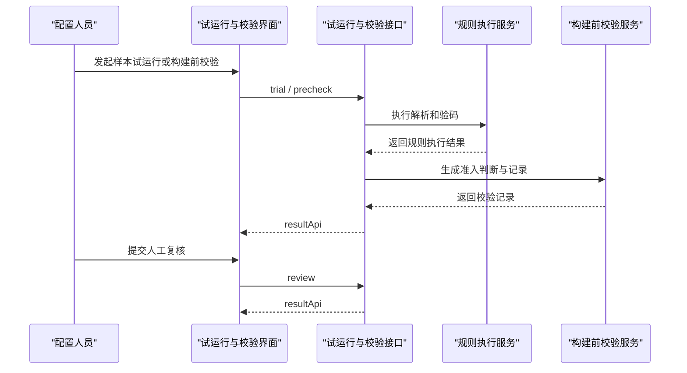

# 编码试运行与构建前校验功能接口设计

## 1. 设计目标

本功能用于验证规则执行效果、给出构建前准入判断，并沉淀异常记录和人工复核入口，避免不合格编码直接进入后续场景自动化生成链路。

## 2. 核心概念

### 2.1 试解析 Trial Translate

试解析是针对样本编码执行一次翻译逻辑验证，用于确认规则命中和解析结果。

### 2.2 试验码 Trial Verify

试验码是针对样本编码执行一次校验逻辑验证，用于确认阻断项、警告项和通过项。

### 2.3 构建前校验记录 Precheck Record

构建前校验记录是一次准入检查的结果快照，记录输入对象、执行结果、异常项和复核状态。

## 3. 接口清单

| 接口 | 方法 | 用途 |
| --- | --- | --- |
| `/api/code-management/trial/translate` | `POST` | 样本试解析 |
| `/api/code-management/trial/verify` | `POST` | 样本试验码 |
| `/api/code-management/precheck` | `POST` | 执行构建前校验 |
| `/api/code-management/precheck-records/page` | `GET` | 分页查询校验记录 |
| `/api/code-management/precheck-records/{recordId}` | `GET` | 查询校验详情 |
| `/api/code-management/precheck-records/{recordId}/review` | `POST` | 提交人工复核结果 |

## 4. 关键接口设计

### 4.1 样本试解析

```text
POST /api/code-management/trial/translate
```

请求体示例：

```json
{
  "sampleCode": "WTG-A01-001",
  "systemCode": "KKS",
  "subjectType": "device"
}
```

响应体示例：

```json
{
  "code": 200,
  "msg": "操作成功",
  "data": {
    "matchedRuleSetId": "RULESET-KKS-01",
    "parseSegments": {
      "segment1": "WTG",
      "segment2": "A01",
      "segment3": "001"
    }
  }
}
```

### 4.2 执行构建前校验

```text
POST /api/code-management/precheck
```

请求体示例：

```json
{
  "codeIds": ["CODE-0001", "CODE-0002"],
  "target": "scene-build"
}
```

响应体示例：

```json
{
  "code": 200,
  "msg": "操作成功",
  "data": {
    "recordId": "PRECHECK-0001",
    "passedCount": 1,
    "warningCount": 1,
    "blockedCount": 0,
    "results": [
      {
        "codeId": "CODE-0001",
        "status": "warning",
        "warnings": ["missing-scene-tag"]
      }
    ]
  }
}
```

### 4.3 提交人工复核结果

```text
POST /api/code-management/precheck-records/{recordId}/review
```

请求体示例：

```json
{
  "reviewAction": "pass-with-note",
  "reviewComment": "允许进入测试场景构建"
}
```

响应体示例：

```json
{
  "code": 200,
  "msg": "操作成功",
  "data": {
    "recordId": "PRECHECK-0001",
    "reviewStatus": "reviewed"
  }
}
```

## 5. 关键对象

| 对象                     | 字段                                           | 说明      |
| ---------------------- | -------------------------------------------- | ------- |
| `TrialTranslateResult` | `matchedRuleSetId` `parseSegments`           | 试解析结果   |
| `TrialVerifyResult`    | `blockedItems` `warnings` `passedRules`      | 试验码结果   |
| `PrecheckRecord`       | `recordId` `target` `summary` `reviewStatus` | 构建前校验记录 |

## 6. 字段级数据字典

### 6.1 TrialTranslateRequest

| 字段 | 类型 | 必填 | 说明 | 映射关系 |
| --- | --- | --- | --- | --- |
| `sampleCode` | string | 是 | 样本编码值 | 运行态输入，不直接落表 |
| `systemCode` | string | 是 | 所属编码体系 | `z_code_system.system_code` |
| `subjectType` | string | 是 | 对象类型 | `z_code_record.subject_type` |

### 6.2 TrialTranslateResult

| 字段 | 类型 | 必填 | 说明 | 映射关系 |
| --- | --- | --- | --- | --- |
| `matchedRuleSetId` | string | 否 | 命中的规则集 ID | `z_code_rule_set.rule_set_id` |
| `parseSegments` | object | 否 | 分段解析结果 | 运行态结果，不直接落表 |

### 6.3 PrecheckRequest

| 字段 | 类型 | 必填 | 说明 | 映射关系 |
| --- | --- | --- | --- | --- |
| `codeIds` | array<string> | 是 | 待校验编码 ID 列表 | `z_precheck_record.code_ids_json` |
| `target` | string | 是 | 校验目标 | `z_precheck_record.target` |

### 6.4 PrecheckResultItem

| 字段 | 类型 | 必填 | 说明 | 映射关系 |
| --- | --- | --- | --- | --- |
| `codeId` | string | 是 | 编码记录 ID | `z_precheck_record.result_json.codeId` |
| `status` | string | 是 | 校验状态 | `z_precheck_record.result_json.status` |
| `warnings` | array<string> | 否 | 警告项 | `z_precheck_record.result_json.warnings` |

### 6.5 PrecheckRecord

| 字段 | 类型 | 必填 | 说明 | 映射关系 |
| --- | --- | --- | --- | --- |
| `recordId` | string | 是 | 校验记录 ID | `z_precheck_record.record_id` |
| `passedCount` | integer | 是 | 通过数量 | `z_precheck_record.passed_count` |
| `warningCount` | integer | 是 | 警告数量 | `z_precheck_record.warning_count` |
| `blockedCount` | integer | 是 | 阻断数量 | `z_precheck_record.blocked_count` |
| `reviewStatus` | string | 否 | 复核状态 | `z_precheck_record.review_status` |
| `createdBy` | string | 否 | 创建人 | `z_precheck_record.created_by` |
| `createdTime` | datetime/string | 否 | 创建时间 | `z_precheck_record.created_time` |
| `updatedBy` | string | 否 | 更新人 | `z_precheck_record.updated_by` |
| `updatedTime` | datetime/string | 否 | 更新时间 | `z_precheck_record.updated_time` |
| `deletedFlag` | integer | 否 | 删除标记 | `z_precheck_record.deleted_flag` |

### 6.6 ReviewRequest

| 字段 | 类型 | 必填 | 说明 | 映射关系 |
| --- | --- | --- | --- | --- |
| `reviewAction` | string | 是 | 复核动作 | `z_precheck_record.review_action` |
| `reviewComment` | string | 否 | 复核说明 | `z_precheck_record.review_comment` |

## 7. MySQL 数据库表示例

### 7.1 构建前校验记录表 `z_precheck_record`

```sql
CREATE TABLE `z_precheck_record` (
  `record_id` varchar(64) NOT NULL COMMENT '校验记录主键',
  `target` varchar(64) NOT NULL COMMENT '校验目标',
  `code_ids_json` json DEFAULT NULL COMMENT '参与校验的编码ID列表',
  `result_json` json DEFAULT NULL COMMENT '校验结果明细',
  `passed_count` int NOT NULL DEFAULT 0 COMMENT '通过数量',
  `warning_count` int NOT NULL DEFAULT 0 COMMENT '警告数量',
  `blocked_count` int NOT NULL DEFAULT 0 COMMENT '阻断数量',
  `review_status` varchar(32) DEFAULT NULL COMMENT '复核状态',
  `review_action` varchar(32) DEFAULT NULL COMMENT '复核动作',
  `review_comment` varchar(255) DEFAULT NULL COMMENT '复核说明',
  `created_by` varchar(64) DEFAULT NULL COMMENT '创建人',
  `created_time` datetime DEFAULT NULL COMMENT '创建时间',
  `updated_by` varchar(64) DEFAULT NULL COMMENT '更新人',
  `updated_time` datetime DEFAULT NULL COMMENT '更新时间',
  `deleted_flag` tinyint(1) NOT NULL DEFAULT 0 COMMENT '删除标记',
  PRIMARY KEY (`record_id`)
) ENGINE=InnoDB DEFAULT CHARSET=utf8mb4 COMMENT='构建前校验记录表';
```

## 8. 常用状态码

| 状态码 | 使用场景 |
| --- | --- |
| `200` | 试运行、校验、复核成功 |
| `400` | 请求对象不完整、目标错误 |
| `404` | 校验记录不存在 |
| `409` | 复核状态冲突 |
| `601` | 校验通过但存在警告项 |

## 9. 系统序列图



## 10. 设计结论

试运行与构建前校验接口的价值在于把“规则是否能跑通”和“对象是否能进入场景构建”分开表达，并把异常和人工复核留痕下来。
